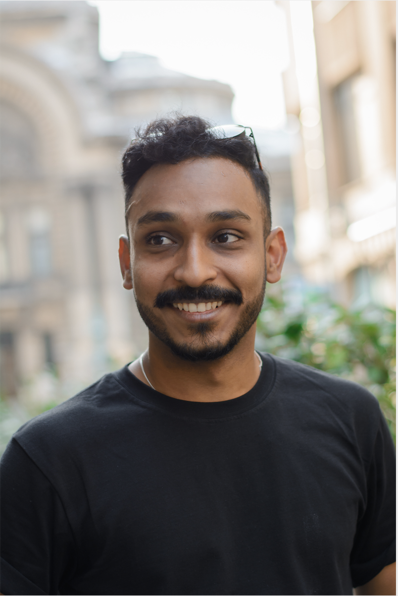
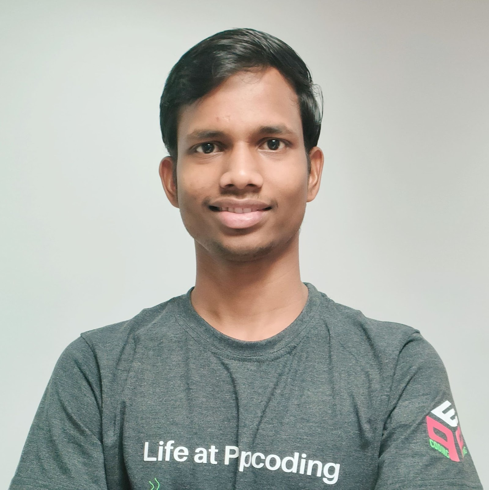
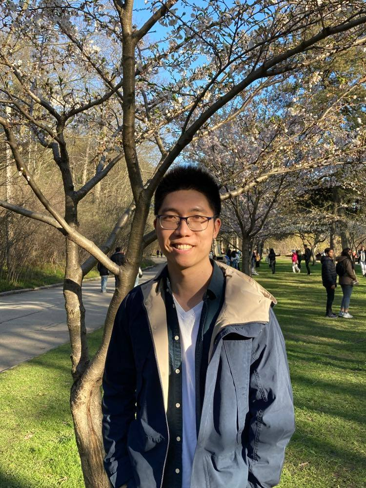

(sprint_testimonial)=
# Meet our 2022 PyMC Google Summer of Code Students

:::{post} June 24, 2022
:tags: gsoc
:category: development
:author: Reshama Shaikh, GSOC 2022 Folks
:image: 0
:exclude:

We are excited to introduce to the community our cohort of GSoC students working on PyMC, Aesara and ArViZ.
:::

## Kunal Ghosh

**Project Name**

Fast Exact Gaussian Processes

**Mentors**
- [Chris Fonnesbeck](https://github.com/fonnesbeck)
- [Bill Engels](https://github.com/bwengals)
::::{grid}
:::{grid-item}
:columns: 12 6 6 4

:::
:::{grid-item}
:columns: 12 6 6 8

**Bio**
> I am a fourth year PhD student in computer science and applied physics at Aalto University, Helsinki, Finland. My research involves developing novel machine learning solutions to challenges in computational materials science. I am broadly interested in generative modelling, materials science and deep learning. I also love teaching and have assisted in courses on Bayesian Data Analysis and Deep Learning at Aalto university.

**Connecting**
- Twitter: [@kunalghosh](https://twitter.com/kunalghosh)
- LinkedIn: [kunalgh](https://www.linkedin.com/in/kunalgh/)
- GitHub: [@kunalghosh](http://github.com/kunalghosh)
:::
::::

Learn more at [Kunal's GSOC blog](https://kunalghosh.github.io/tags/gsoc).

1. __What motivated you to apply for GSoC with PyMC?__ 
  
     During one of the cold and dark winter evenings in Helsinki I was chatting with some fellow PhD students about my future life plans. I wasn't sure what exactly I wanted to do, but having written a few large pieces of software for my research projects I appreciated the importance of writing good quality code. I knew that Osvaldo Martin (one of the core PyMC devs) was working on PyMC and after one of our group meetings (Osvaldo was doing a Post-doc with my PhD supervisor Aki) I asked if there was a possibility to work on PyMC since it would be a good opportunity for me to learn good software engineering practices and also contribute to open source (I was quite an avid KDE user back in the day). One thing lead to another and I applied to GSoC under PyMC and now I'm here :)

1. __Why did you choose your specific project topic?__

     I was looking for potential projects which I had some prior experience and background in. Since I have some prior experience with using Gaussian processes and have also implemented them from scratch before, fast exact Gaussian process was a natural choice! Reasonably familiar but with still some scope to learn.

1. __How did you get involved in open source software?__

    I started quite early, initially as a Linux user in the early 2000s while I was in high school. During my undergraduate years, I setup a free software user group in our university and also organised workshops about free software for scientific work. Subsequently, I participated in KDE's Season of KDE and then a GSoC for the OwnCloud project. But all through, I've just had a deep love and appreciation for free and open source software.

1. __What are you expecting or hoping to get out of your GSoC experience?__

    I will implement fast exact Gaussian processes in PyMC and have the code ready to be committed to mainline, hopefully by the end of GSoC. But more importantly learn good software engineering practices and hopefully continue to be a long term contributor of PyMC.

1.  __What are your career goals? How do you see the GSoC program moving you towards them?__

    I love teaching and working on research problems. I would like to do a part-time post-doc and work as a researcher in the industry, prototyping new solutions to challenging problems in the industry. If there is any company out there reading this and wants to have a chat, don't hesitate to get in touch with me ;). Apart from that, I enrolled in GSoC purely to learn better software engineering practices, I am sure that would be useful regardless of what I end up doing :)

## Purna Chandra Mansingh

**Project Name**

Increase Support for Batched Multivariate Distributions

**Mentors**
- [Sayam Kumar](https://github.com/Sayam753)
- [Ricardo Vieira](https://github.com/ricardoV94)
::::{grid}
:::{grid-item} 
:columns: 12 6 6 4

:::
:::{grid-item}
:columns: 12 6 6 8

**Bio**
>I am a final-year student at Hyderabad Central University pursuing a Master's in Computer Applications. I've been working in the fields of data science and machine learning for the past year. I enjoy working on complex problems and am a technical instructor. In my spare time, I enjoy contributing what I've learned to open-source projects.

**Connecting** 
- Twitter: [@purna_mansingh](https://twitter.com/purna_mansingh)
- LinkedIn: [purna135](https://www.linkedin.com/in/purna135/)
- GitHub: [@purna135](http://github.com/purna135)
:::
::::

Learn more at [Purna's GSOC blog](https://purna135.github.io/gsoc/gsoc-2022-with-pymc/).

1. __What motivated you to apply for GSoC with PyMC?__

     GSoC is a place where I can not only apply my existing skills but also learn new ones. And the learning does not stop with technical knowledge. GSoC introduces me to a new paradigm for collaboratively developing code. Furthermore, GSoC is a platform that allows me to build on and hone my current skills, which motivates me to apply for GSoC.

1. __Why did you choose your specific project topic?__

    I'm very interested in machine learning and discovered PyMC a while ago; I actually started contributing before I knew about GSoC. I later discovered GSoC and realized this project was a good fit for my skills.

1. __How did you get involved in open source software?__

    As I didn't have the time to actively contribute, I started by fixing minor bugs in libraries and tools I came across in general. I began by sending small pull requests to PyMC, Scikit-learn, Python, Pandas, and other libraries that I had been using while learning Machine Learning. I learned about GSoC project openings in the PyMC organization and applied for it.

1. __What are you expecting or hoping to get out of your GSoC experience?__

    I'm hoping to interact and share ideas with some amazing people during the 12 weeks of GSoC. In the end, I hope to have made some wonderful friends from all over the world with whom I can talk about fun projects, get feedback on my code, and just about anything else. I'm hoping to meet nice, knowledgeable, and smart people who are all gathered in one place, united, and working toward a common goal.

1. __What are your career goals? How do you see the GSoC program moving you towards them?__

    I want to pursue a career in software development and the GSoC experience will help me to gain the skills I need to design and implement large and highly optimized software.

## Larry Dong

**Project Name**

A PyMC Dirichlet Process Submodule via AePPL Enhancements

**Mentors**
- [Ricardo Vieira](https://github.com/ricardoV94)
- [Brandon Willard](https://github.com/brandonwillard)

::::{grid}
:::{grid-item} 
:columns: 12 6 6 4

:::
:::{grid-item}
:columns: 12 6 6 8

**Bio**
>I am a second year PhD student in biostatistics at the Dalla Lana School of Public Health at the University of Toronto in Toronto, Canada. My academic interests revolve around dynamic treatment regimes and Bayesian methods. I began my PhD during the pandemic which has allowed me to be immersed in open-source, particularly in the PyMC community. My first GSoC project entailed implementing a Dirichlet Process submodule for PyMC and I’m back for another GSoC to continue this project and to learn more about Aesara and AePPL.

**Connecting**

- Twitter: [@larryshamalama](https://twitter.com/larryshamalama)
- LinkedIn: [larry-dong](https://www.linkedin.com/in/larry-dong/)
- GitHub: [@larryshamalama](https://github.com/larryshamalama)
:::
::::

Learn more at [Larry's GSOC blog](https://larrydong.com/gsoc )

1. __What motivated you to apply for GSoC with PyMC?__

I initially found out about the possibility to do GSoC with PyMC by browsing Twitter in March 2020. It was my second remote semester of my first year of PhD program and it was tiring me out; I knew that I needed a change of scenery from my online studies. Contributing to open-source was not an idea that occurred to me before entering my PhD yet it was a very appealing one. I knew that it is a nice opportunity to learn, especially when it comes to programming and contributing to an established codebase, and interact with members of a community. I wrote a more in-depth blogpost about my experience starting a PhD remotely and discovering open-source via GSoC: [https://larrydong.com/posts/2022-06-18-value-oss/](https://larrydong.com/posts/2022-06-18-value-oss/).

2. __Why did you choose your specific project topic?__

In summer of 2020, I attended an online [summer school on Dirichlet Processes](https://www.youtube.com/playlist?list=PLHaWeIntAtAIjrTCeQ5ZfNlG2HRvtGOu4) and I barely understood anything. However, they seemed interesting and I was somehow appealed by the method. As such, I decided to jump head first into implementing a functionality in PyMC for Dirichlet Processes given there was an opportunity.

3. __How did you get involved in open source software?__

I started small, like everyone, by fixing typos and updating trivial things. Even just creating pull request sometimes took me many attempts. It was during GSoC that I really started getting more involved in open-source.

4. __What are you expecting or hoping to get out of your GSoC experience?__

In terms of the project, I would like to have a Dirichlet Process submodule available in PyMC experimental and have a solid foundation of Aesara and AePPL to be a longer term contributor. However, probably a more important goal of mine would be to continue foster the nice and inclusive community that first welcomed me when I was going through a hard time.

5. __What are your career goals? How do you see the GSoC program moving you towards them?__

My exact career goals are still yet to be determined, but GSoC has showed me that there is a world where my graduate education in statistics and programming skills would be very valuable in the real world. I would like to find a job following my graduation (fingers crossed) that makes use of such skills, but, frankly, I don’t know what exact career I’m preparing myself for. I guess an inherent beauty of contributing open-source is that I can perhaps discover future career prospects as I work on and enjoy my GSoC project!

## Danh Phan

**Project Name**

Multi-output Gaussian Processes in PyMC

**Mentors**
- [Chris Fonnesbeck](https://github.com/fonnesbeck)
- [Bill Engels](https://github.com/bwengals)
::::{grid}
:::{grid-item}
:columns: 12 6 6 4

:::
:::{grid-item}
:columns: 12 6 6 8

**Bio**
> Hi, my name is Danh Phan, a PhD candidate at Monash University, Australia. My research focuses on Machine learning (Bayesian methods, choice models, tree-based, and deep neural networks) for intelligent transport systems. I have more than four years of experience working on different machine learning algorithms, and have published several papers in the machine learning field. Besides, I have worked as an instructor at [Monash Data Fluency](https://www.monash.edu/data-fluency/workshops), where I teach hand-one workshops on Python, Git, and High-Performance Computing to research students and staff at Monash University. I have also been worked with Bayesian methods in PyMC for nearly two years.

**Connecting**
- Twitter: [@danhpt](https://twitter.com/danhpt)
- LinkedIn: [danhpt](https://www.linkedin.com/in/danhpt)
- GitHub: [@danhphan](https://github.com/danhphan)
:::
::::

Learn more at [Danh Phan's blog](https://danhphan.github.io/blog).

1. __What motivated you to apply for GSoC with PyMC?__ 
  
     My first experience working with Bayesian methods (Bayesian Networks, GLM) is learning from PyMC code examples and resources. The useful learning materials and excellent community support help me a lot in my journey to perform Bayesian analysis. With the great support from the PyMC dev team, I have recently contributed several pull requests (PRs) to PyMC and Aesara GitHub codebase. Moreover, I want to involve long-term with this community to learn and contribute along the way.

2. __Why did you choose your specific project topic?__

     I am interested in applying Gaussian Processes to analyse real-world datasets, which have temporal and spatial features. In my current research topic, I have been working on the Multi-outputs Gaussian Processes (MOGPs) for generating people’s travel activity time. Thus, I would love to contribute to the PyMC library by adding MOGPs feature to the PyMC’s GP module.

3. __How did you get involved in open source software?__

     One of my old friends told me that it is a good idea to contribute to open source, so I can contribute and learn along the way. As I had used PyMC for some time in my work and found it really valuable, I decided to contribute to the PyMC project. My first pull request on PyMC GitHub was creating a helper `pm.draw()` function to take draws for a given variable. It took quite a while for the [PR](https://github.com/pymc-devs/pymc/pull/5340) to be merged, but I learned useful things like writing docstrings and test cases.

4. __What are you expecting or hoping to get out of your GSoC experience?__

     My project aims to add support for multi-output Gaussian processes (GPs) in PyMC. The advantage of multi-output GPs is their capacity to simultaneously learn and infer many outputs which have the same source of uncertainty from inputs. This model provides a practical approach for various applications in different fields. Hence, the multi-output GPs feature would significantly extend the capabilities of PyMC GP module and benefit the PyMC community.  

     I plan to incorporate a Linear Model of Coregionalization and a Hadamard Regression Model into PyMC GP module. This project is an excellent opportunity to sharpen my coding skills, including designing user APIs, writing classes, docstrings and tests, and notebook examples. Furthermore, I hope to have more good friends and learn more from my mentors and other PyMC devs. They are extremely supportive, and I feel lucky to be involved in this project.

5.  __What are your career goals? How do you see the GSoC program moving you towards them?__

     I want to be an effective Data Scientist who can develop data-driven products to solve real-world problems and help businesses make efficient science-based decisions. I see that the Bayesian method is an intuitive and practical way to solve various issues, especially the ones that need to account for uncertainty. Indeed we also need other machine learning methods, and it will depend on specific use cases. 
     
     The GSoC project will allow me to learn more about Bayesian statistics, especially nonparametric models. This knowledge is valuable for developing various applications in different fields. In addition, I can improve my communication skills and the capability to work in a diverse and international team.