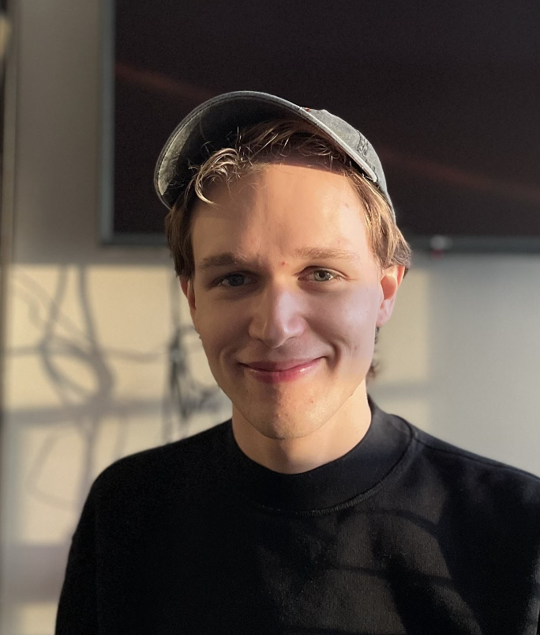
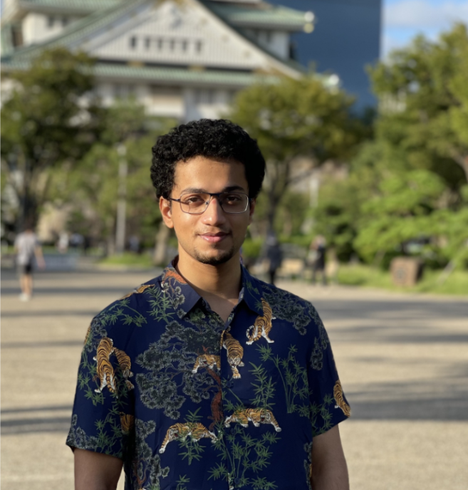

(gsoc_2023_presentations)=
# Meet our 2023 PyMC Interns

:::{post} June 26, 2023
:tags: gsoc, community, contributing
:category: news, testimonial
:author: Reshama Shaikh, 2023 PyMC Interns
:image: 0
:exclude:

We are excited to introduce to the community our cohort of 2023 Interns working on PyMC, Aesara and Bambi.
:::

## Daniel Saunders

**Project Name**

Expand support for spatial models in PyMC

**Mentors**
- [Chris Fonnesbeck](https://github.com/fonnesbeck)
- [Bill Engels](https://github.com/bwengals)
::::{grid}
:::{grid-item}
:columns: 12 6 6 4

:::
:::{grid-item}
:columns: 12 6 6 8

**Bio**
> I’m a philosophy PhD student at the University of British Columbia. My academic work looks at the foundations of behavioral science - what frameworks are best for understanding and modeling human behavior? What’s the right way to evaluate abstract theoretical models against data? I’m interested in Bayesian statistics because it presents some novel ways of thinking about those questions.

**Connecting**
- Twitter: [@CarolBasknRobns](https://twitter.com/CarolBasknRobns)
- GitHub: [@daniel-saunders-phil](https://github.com/daniel-saunders-phil)
:::
::::

Find out more at [Daniel's GSOC blog](https://daniel-saunders-phil.github.io/imagination_machine/).

1. __What motivated you to apply for GSoC with PyMC?__ 
  
     A few years ago, I started reading Richard McElreath’s marvelous book Statistical Rethinking and fell in love with probabilistic programming. My prior coding experience was in Python so PyMC was a natural choice of probabilistic programming language to pick up. Since then, I’ve really grown to love the package and wanted to learn how to contribute to it in a serious way.

1. __Why did you choose your specific project topic?__

     I knew I would be better suited to work on the modeling side than the backend or visualization side. So that left only a couple of suggested projects from the list put out by the PyMC team. Spatial statistics involves working with large covariance matrices which I think are really neat. So it was the logical choice.

1. __How did you get involved in open source software?__

     I participated in a PyMC sprint in July 2022, organized with Data Umbrella. I remember Reshama Shaikh, Ravin Kumar, Rowan Schaefer, and Oriol Abril Pla being really nice and super helpful. They taught me how git works and how to tidy up doc strings.
     The world of open source was definitely overwhelming at first but I enjoyed being in a completely foreign environment. I just lurked on github for the next few months before applying to GSoC.

1. __What are you expecting or hoping to get out of your GSoC experience?__

     I want to grow my skills and my community. Working on large, collaborative software projects is a completely different challenge so I would like to get a feel for how they work. Similarly, my project is really going to push my knowledge of probabilistic programming forward. Getting to know who works in this space and what projects excite them is the other thing I’m really looking forward to.

1.  __What are your career goals? How do you see the GSoC program moving you towards them?__

    I’d like to work in probabilistic programming, either in academia or the private sector. My prior experience has been heavily academic so I’m eager to step just a bit outside that world and get connected with people who work on the private sector side. GSoC will diversify my experience in a way I hope opens new doors.

## Shreyas Singh

**Project Name**

Support Automatic Derivation of Arbitrary Censoring logp

**Mentors**
- [Larry Dong](https://github.com/larryshamalama)
- [Ricardo Vieira](https://github.com/ricardoV94)
::::{grid}
:::{grid-item} 
:columns: 12 6 6 4

:::
:::{grid-item}
:columns: 12 6 6 8

**Bio**
>I am an incoming Master’s student in Scientific Computing at the University of Pennsylvania and my areas of interest include symbolic computation and probabilistic programming. I have worked on using statistical analysis tools in computational physics followed by software development at Accenture Japan. I am fascinated by the computational backend structures used in data science and to that end, I have been enjoying contributing to PyTensor and PyMC in my relatively new open-source journey.

**Connecting** 
- Twitter: [@shreyas_singh_](https://twitter.com/shreyas_singh_)
- LinkedIn: [shreyassinghiitr](https://www.linkedin.com/in/shreyassinghiitr/)
- GitHub: [@shreyas3156](http://github.com/shreyas3156)
:::
::::

Find out more at [Shreyas's GSOC blog](https://shreyas3156.github.io/gsoc-with-pymc).

1. __What motivated you to apply for GSoC with PyMC?__

     My undergraduate major was Engineering Physics, but it was while doing a minor in Mathematics that I realized my affinity for statistics and computational math. Although I had prior development experience in Java at my job, I wanted to pursue probabilistic programming with more rigor. 

     While going through the organizations that participated in GSoC, I found out about PyMC. The extensive PyMC examples, PyMCon Web Series, and an active community both on GitHub and Discourse were what appealed to me the most.

1. __Why did you choose your specific project topic?__

     I was quite fascinated by PyTensor, the computational backend of PyMC, and how it accounts for various kinds of operations and optimizations under the hood. The concept of log-probabilities, one of the central blocks in PyMC, and graph computation were all very intriguing. Additionally, the usage of arbitrary censoring in survival analysis, especially in infectious disease research was a driving factor too.

1. __How did you get involved in open source software?__

     Despite having prior experience in software development and data analytics, it was only recently that I got introduced to the world of open source. A few friends suggested contributing to open-source software as the learning curve is sharp but rewarding. I have been amazed by the diversity of contributions and the willingness of developers from all backgrounds to work together towards a common goal and share their knowledge with those who wish to learn.

1. __What are you expecting or hoping to get out of your GSoC experience?__

     I hope to add the log-probability inference for as many cases of arbitrary censoring as possible, taking in some special edge cases into consideration as well. The end goal would also be to port these likelihoods into Bambi and proper documentation for the entire logprob submodule. Overall, I expect to learn a lot from my mentors and other members of the organization, and become a regular contributor to PyMC along with learning the best practices in open source.

1. __What are your career goals? How do you see the GSoC program moving you towards them?__

     I aspire to become a proficient Data Scientist in the sectors pertaining to sciences, such as meteorology, astronomy or healthcare. The GSoC program with PyMC and especially a project as engaging would provide me with a strong foundation for statistical modeling and machine learning. I had already got to learn a great deal during the application phase of GSoC and the variety of opportunities in open-source projects would keep my curiosity piqued.

