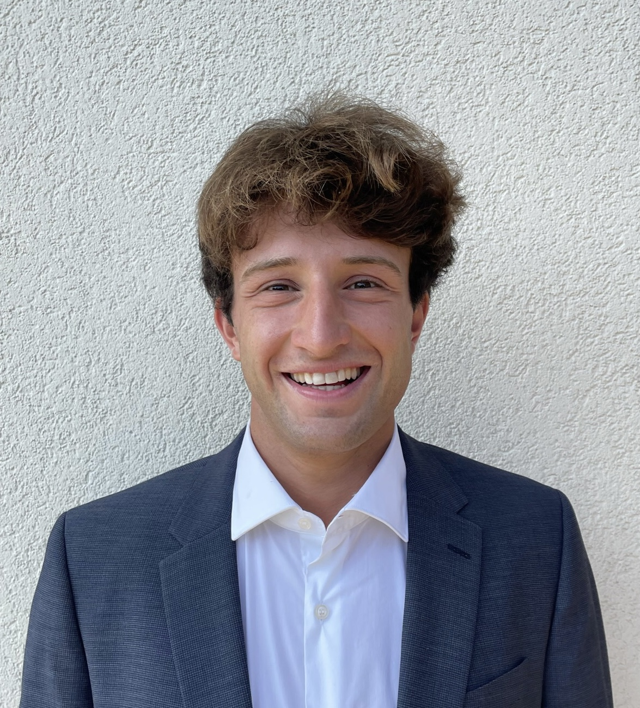

(interns_2025_presentations)=
# Meet our 2025 GSoC PyMC Interns

:::{post} June 6, 2025
:tags: gsoc, community, contributing
:category: news, testimonial
:author: Reshama Shaikh, 2025 PyMC Interns
:image: 0
:exclude:

We are excited to introduce to the community our cohort of 2025 Interns working on PyMC.
:::

## Michal Novomestsky

**Project Name**

Implementing Integrated Nested Laplace Approximations (INLA)

**Project Description**

>A key component of Bayesian inference is integrating over prior distributions to obtain posteriors. In practice however, these distributions are often high-dimensional, resulting in a significant computational cost associated with integration, which remains a key challenge in Bayesian ML. Under certain assumptions, it is possible to efficiently compute posteriors for Latent Gaussian Models (LGMs), which represent a broad class of statistical models in Bayesian statistics. This is known as the method of Integrated Nested Laplace Approximations (INLA), and this project aims to implement a working basis for INLA in the PyMC library.

**Mentors**
- [Rob Zinkov](https://github.com/zaxtax)
- [Colt Allen](https://github.com/ColtAllen)
- [Theo Rashid](https://github.com/theorashid)
::::{grid}
:::{grid-item}
:columns: 12 6 6 4

:::
:::{grid-item}
:columns: 12 6 6 8

**Bio**
>I am a 4th year undergraduate student at Monash University in Australia, studying Aerospace Engineering (Honours). Although I come from a physics/engineering background in fluids, I have since shifted toward ML/AI as I have found some of the research directions in this space very exciting. My research interests can be summed up as “how can we embed priors/known information into AI/ML models?” and “how can we get them to reason and provide guarantees about their output?”. Bayesian ML is a promising direction to address these questions and is a key interest of mine.

**Connecting**
- Website: [michal-novomestsky.github.io/](https://michal-novomestsky.github.io/)
- LinkedIn: [@michal-novomestsky](https://linkedin.com/in/michal-novomestsky)
- GitHub: [@Michal-Novomestsky](https://github.com/Michal-Novomestsky)
:::
::::

1. __What motivated you to apply for the internship with PyMC?__ 
  
     As mentioned in my bio, I am interested in pursuing research focused on developing more principled and structured AI models, as well as understanding the internal behaviour of existing architectures. Bayesian statistics provides potential inroads to address both these challenges. As such, I felt that this would be an excellent opportunity to better understand the field as well as network with experts.

1. __Why did you choose your specific project topic?__

     I have a taste for more fundamental research in AI, largely focused on the math underpinning it. Of the projects on offer with PyMC, INLA seemed to fit this description best - a fundamental technique used to estimate posteriors - in other words, it would be a project with a theoretical focus much closer to the models themselves, rather than focusing on more backend aspects.

1. __How did you get involved in open source software?__

     Having written an academic paper in the past, I have previously developed tools for data analysis and denoising which are publicly available on my GitHub.

1. __What are you expecting or hoping to get out of your internship experience?__

     I am aiming to develop a better understanding of Bayesian statistics not only from a theoretical perspective, but also to better appreciate some of the technical challenges it faces in practice. I also hope to gain invaluable connections from this project.

1.  __What are your career goals? How do you see the internship program moving you towards them?__

     I am hoping to pursue a career in research, in particular focusing on developing more robust and interpretable AI, and GSoC is an excellent opportunity to be able to network with experts across both industry and academia, which I hope will open doors for me to continue to pursue this passion.

## Andrea Catelli

**Project Name**

State-Space Models: Dynamic Factor Models

**Project Description**

> This project extends PyMC’s state-space module by implementing Bayesian Dynamic Factor Models (DFMs), similar to those available in statsmodels. DFMs capture co-movements in multiple time series using a few latent factors. Built on PyMC and PyTensor, the implementation includes an example notebook to demonstrate the use of the new model. This enhancement broadens PyMC’s capabilities for students, practitioners, and researchers to model complex time-series data probabilistically.
> 

**Mentors**
- [Jesse Grabowski](https://github.com/jessegrabowski)
::::{grid}
:::{grid-item}
:columns: 12 6 6 4

:::
:::{grid-item}
:columns: 12 6 6 8

>I am in the final semester of my Master’s degree in Quantitative Finance at Politecnico di Milano, where I also completed a Bachelor’s in Mathematical Engineering. I am deeply interested in using mathematics to model complex systems, with a particular fascination for financial markets, where economics, politics, technology, and human behavior intersect to shape highly dynamic environments. My work focuses on probability, statistics, and machine learning as tools to better understand and model this complexity.

**Connecting**
- LinkedIn: [@Andrea-Catelli](https://www.linkedin.com/in/andrea-catelli1234)
- GitHub: [@Andrea-Catelli](https://github.com/andreacate)
:::
::::

1. __What motivated you to apply for the internship with PyMC?__
   
     I was motivated by the opportunity to contribute to a large open-source project like PyMC, which plays a key role in the Bayesian statistics community. I also saw it as a chance to engage with experienced developers and researchers, and to gain hands-on experience with probabilistic programming tools that I had not formally studied during my academic career.

1. __Why did you choose your specific project topic?__

     I chose to work on time series modeling, in particular Dynamic Factor Models because it aligns closely with my research interests in quantitative finance. Financial and economic data are inherently high-dimensional and dynamic, and I was excited by the possibility of extending PyMC’s capabilities to better capture such complex structures. This project was a great opportunity to connect my background with hands-on experience in Bayesian time series modeling.
   
1. __How did you get involved in open source software?__

     During university, I was fascinated by the idea that such powerful tools are freely available to everyone and continuously improved by communities. When I heard about Google Summer of Code from another Italian student, I saw it as a great opportunity to contribute to open source for the first time.

1. __What are you expecting or hoping to get out of your internship experience?__

     I am eager to learn how to collaborate effectively within a large open-source project, understand best practices for contributing through GitHub, and work as part of a development community. I also hope to deepen my understanding of Bayesian statistics, not only in theory but also through hands-on implementation in real-world modeling tasks.

1.  __What are your career goals? How do you see the internship program moving you towards them?__

     I hope this internship will help me strengthen my technical skills and connect with interesting people from around the world. My long-term goal is to apply mathematics to understand and simulate complex systems, such as financial markets, and this experience is a valuable step in that direction.
   

## References

- [2025 GSoC NumFOCUS projects](https://summerofcode.withgoogle.com/programs/2025/organizations/numfocus)
- [2025 PyMC GSoC applications blog](https://www.pymc.io/blog/blog_gsoc_2025_announcement.html)
- [2024 GSoC NumFOCUS projects](https://summerofcode.withgoogle.com/programs/2024/organizations/numfocus)
- [2019 NumFOCUS GSoC announcement](https://numfocus.org/blog/meet-our-2019-gsoc-students-part-2)

### GSoC Interns Announcements
- [2022 GSoC PyMC blog](https://www.pymc.io/blog/blog_gsoc_2022.html)
- [2023 GSoC PyMC blog](https://www.pymc.io/blog/blog_gsoc_2023.html)
- 2024 GSoC PyMC blog: none

