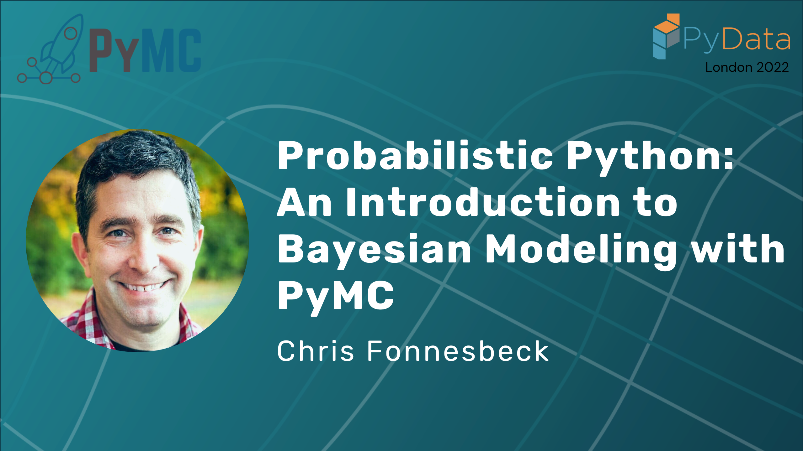

(PyData_London_2022)=
# Probabilistic Python: An Introduction to Bayesian Modeling with PyMC

:::{post} November 1, 2022
:tags: events, community, talks
:category: news, testimonial
:author: Beryl Kanali, Chris Fonnesbeck
:image: 0
:exclude:

Chris Fonnesbeck gave a talk on Bayesian Modeling at PyData London 2022. Here is a summary blog of the talk.
:::

## Introduction

Bayesian statistical methods offer a powerful set of tools to tackle a wide variety of data science problems. In addition, the Bayesian approach generates results that are easy to interpret and automatically account for uncertainty in quantities that we wish to estimate and predict. Historically, computational challenges have been a barrier, particularly to new users, but there now exists a mature set of probabilistic programming tools that are both capable and easy to learn. We will use the newest release of PyMC (version 4) in this tutorial, but the concepts and approaches that will be taught are portable to any probabilistic programming framework.

This tutorial is intended for practicing and aspiring data scientists and analysts looking to learn how to apply Bayesian statistics and probabilistic programming to their work. It will provide learners with a high-level understanding of Bayesian statistical methods and their potential for use in a variety of applications. They will also gain hands-on experience with applying these methods using PyMC, specifically including the specification, fitting and checking of models applied to a couple of real-world datasets.

As this is an introductory tutorial, no direct experience with PyMC or Bayesian statistics will be required. However, to benefit maximally from the tutorial, learners should have some familiarity with basic statistics (things like regression and estimation) and with core components of the scientific Python stack (e.g. NumPy, pandas and Jupyter).

As the goal of the tutorial is to get new users up and running with Bayesian methods, the content is light on theory and focus on the implementation of models, though some statistical background will be provided for context and clarity. Since PyMC is a high-level statistical package, it is easy to gloss over important details of the underlying algorihtms. Therefore, the tutorial begins by solving a simple model using only NumPy and SciPy functions before diving into PyMC. As a capstone to the tutorial, learners will be introduced to "The Bayesian Workflow" to reiterate the important steps in the process, along with useful tips and tricks.

## About the Speaker

Chris is the Principal Quantitative Analyst in Baseball Research & Development for the Philadelphia Phillies. He is interested in computational statistics, machine learning, Bayesian methods, and applied decision analysis. He hails from Vancouver, Canada and received his Ph.D. from the University of Georgia.

- GitHub: https://github.com/fonnesbeck
- LinkedIn: https://www.linkedin.com/in/christopher-fonnesbeck-374a492a

## Video

 
<iframe width="560" height="315" src="https://www.youtube.com/embed/911d4A1U0BE?start=3" title="YouTube video player" frameborder="0" allow="accelerometer; autoplay; clipboard-write; encrypted-media; gyroscope; picture-in-picture" allowfullscreen></iframe>
 

## Timestamps
[00:00](https://www.youtube.com/watch?v=911d4A1U0BE&t=0s) Welcome!

[0:08](https://www.youtube.com/watch?v=911d4A1U0BE&t=8s) Introduction

[1:19](https://www.youtube.com/watch?v=911d4A1U0BE&t=79s) Probabilistic programming

[1:53](https://www.youtube.com/watch?v=911d4A1U0BE&t=113s) Stochastic language ”primitives”

[3:06](https://www.youtube.com/watch?v=911d4A1U0BE&t=186s) Bayesian inference

[3:27](https://www.youtube.com/watch?v=911d4A1U0BE&t=207s) What is Bayes?

[3:57](https://www.youtube.com/watch?v=911d4A1U0BE&t=237s) Inverse probability

[4:21](https://www.youtube.com/watch?v=911d4A1U0BE&t=261s) Stochastic programs

[4:39](https://www.youtube.com/watch?v=911d4A1U0BE&t=279s) Why Bayes

[5:13](https://www.youtube.com/watch?v=911d4A1U0BE&t=313s) The Bayes formula

[6:51](https://www.youtube.com/watch?v=911d4A1U0BE&t=411s) Prior distribution

[8:12](https://www.youtube.com/watch?v=911d4A1U0BE&t=492s) Likelihood function

[8:29](https://www.youtube.com/watch?v=911d4A1U0BE&t=509s) Normal distribution

[8:53](https://www.youtube.com/watch?v=911d4A1U0BE&t=533s) Binomial distribution

[9:14](https://www.youtube.com/watch?v=911d4A1U0BE&t=554s) Poisson distribution

[9:32](https://www.youtube.com/watch?v=911d4A1U0BE&t=572s) Infer values for latent variables

[9:47](https://www.youtube.com/watch?v=911d4A1U0BE&t=587s) Probabilistic programming abstracts the inference procedure

[9:54](https://www.youtube.com/watch?v=911d4A1U0BE&t=594s) Posterior distribution

[10:56](https://www.youtube.com/watch?v=911d4A1U0BE&t=656s) Bayes by hand

[12:18](https://www.youtube.com/watch?v=911d4A1U0BE&t=738s) Conjugacy

[16:43](https://www.youtube.com/watch?v=911d4A1U0BE&t=1003s) Probabilistic programming in Python

[17:24](https://www.youtube.com/watch?v=911d4A1U0BE&t=1044s) PyMC and its features

[19:15](https://www.youtube.com/watch?v=911d4A1U0BE&t=1155s) Question: Among the different probabilistic programming libraries, is there a difference in what they have to offer?

[20:39](https://www.youtube.com/watch?v=911d4A1U0BE&t=1239s) Question: How can one know which likelihood distribution to choose?

[21:35](https://www.youtube.com/watch?v=911d4A1U0BE&t=1295s) Question: Is there a methodology used to specify the likelihood distribution?

[22:30](https://www.youtube.com/watch?v=911d4A1U0BE&t=1350s) Example: Building models in PyMC

[27:31](https://www.youtube.com/watch?v=911d4A1U0BE&t=1651s) Stochastic and deterministic variables

[37:11](https://www.youtube.com/watch?v=911d4A1U0BE&t=2231s) Observed Random Variables

[41:00](https://www.youtube.com/watch?v=911d4A1U0BE&t=2460s) Question: To what extent are the features of PyMC supported if compiled in different backends?

[41:47](https://www.youtube.com/watch?v=911d4A1U0BE&t=2507s) Markov Chain Monte Carlo and Bayesian approximation

[43:04](https://www.youtube.com/watch?v=911d4A1U0BE&t=2584s) Markov chains

[44:19](https://www.youtube.com/watch?v=911d4A1U0BE&t=2659s) Reversible Markov chains

[45:06](https://www.youtube.com/watch?v=911d4A1U0BE&t=2706s) Metropolis sampling

[48:00](https://www.youtube.com/watch?v=911d4A1U0BE&t=2880s) Hamiltonian Monte Carlo

[49:10](https://www.youtube.com/watch?v=911d4A1U0BE&t=2950s) Hamiltonian dynamics

[50:49](https://www.youtube.com/watch?v=911d4A1U0BE&t=3049s) No U-turn Sampler (NUTS)

[52:11](https://www.youtube.com/watch?v=911d4A1U0BE&t=3131s) Question: How do you know the number of leap frog steps to take?

[52:55](https://www.youtube.com/watch?v=911d4A1U0BE&t=3175s) Example: Markov Chain Monte Carlo in PyMC

[1:13:30](https://www.youtube.com/watch?v=911d4A1U0BE&t=4410s) Divergences and how to deal with them

[1:15:08](https://www.youtube.com/watch?v=911d4A1U0BE&t=4508s) Bayesian Fraction of Missing Information 

[1:16:25](https://www.youtube.com/watch?v=911d4A1U0BE&t=4585s) Potential Scale Reduction

[1:17:57](https://www.youtube.com/watch?v=911d4A1U0BE&t=4677s) Goodness of fit

[1:22:40](https://www.youtube.com/watch?v=911d4A1U0BE&t=4960s) Intuitive Bayes course

[1:23:09](https://www.youtube.com/watch?v=911d4A1U0BE&t=4989s) Question: Do bookmakers use PyMC or Bayesian methods?

[1:23:53](https://www.youtube.com/watch?v=911d4A1U0BE&t=5033s) Question: How does it work if you have different samplers for different variables?

[1:25:09](https://www.youtube.com/watch?v=911d4A1U0BE&t=5109s) Question: What route should one take in case of data with many discrete variables and many possible values?

[1:25:39](https://www.youtube.com/watch?v=911d4A1U0BE&t=5139s) Question: Is there a natural way to use PyMC over a cluster of CPUs?

## PyMC institutional partners
[PyMC Labs](https://www.pymc-labs.io/)

[Intuitive bayes course](https://www.intuitivebayes.com/introductorycourse)

### Connect with PyMC

Connect with PyMC via:
- Website:  [pymc.io](https://www.pymc.io)
- Discourse: [discourse.pymc.io](https://discourse.pymc.io)
- YouTube: [PyMCDevelopers](https://www.youtube.com/c/PyMCDevelopers)
- Star GH repo:  [pymc-devs/pymc](https://github.com/pymc-devs/pymc)
- Join Meetup: [pymc-online-meetup](https://www.meetup.com/pymc-online-meetup/)
- Twitter: [@pymc_devs](https://twitter.com/pymc_devs)
- LinkedIn: [@pymc](https://www.linkedin.com/company/pymc/)
