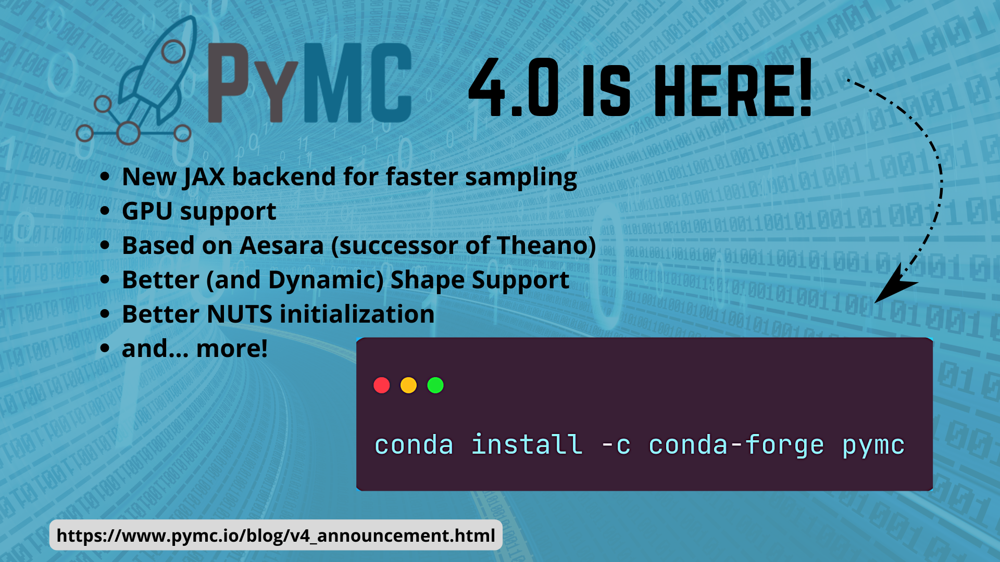
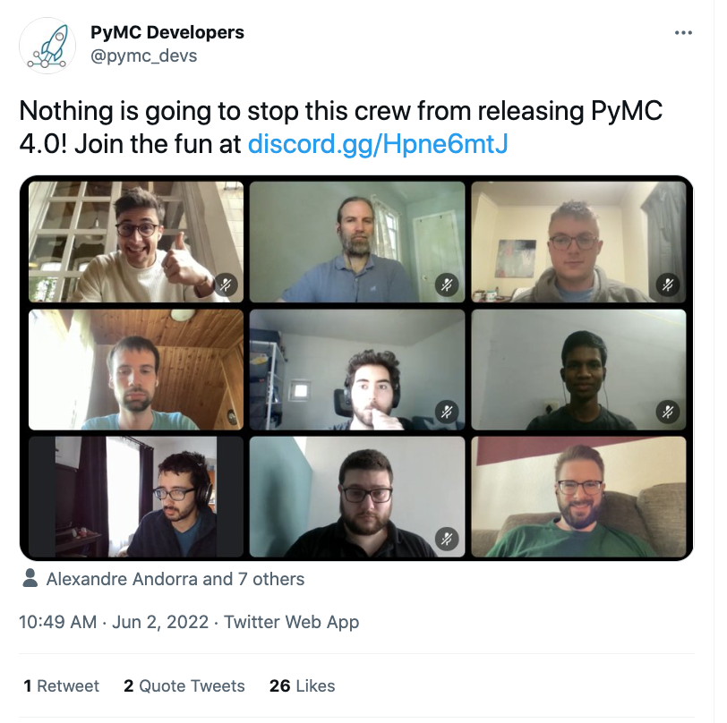
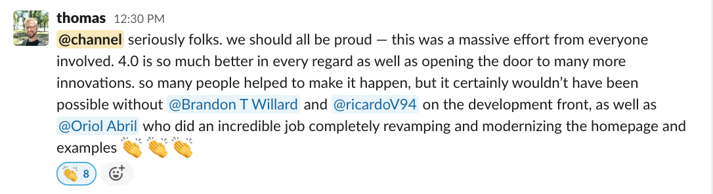

(v4_release_hackathon)=
# Dev Sprint: Getting the PyMC v4.0 Release Out

:::{post} Jun 24, 2022
:tags: sprint, contributing
:category: news
:author: Reshama Shaikh, Thomas Wiecki
:image: 0
:exclude:

The PyMC team coordinated a development hackathon in May/June 2022 to complete updates and documentation in order to release [v4.0 of the PyMC library](https://twitter.com/pymc_devs/status/1533863780601446401).
:::

The [v4.0 release of the PyMC library](https://twitter.com/pymc_devs/status/1533863780601446401) was officially announced on June 6, 2022.  To achieve this milestone, the PyMC team planned a week-long online sprint beginning May 30, 2022.  The goal was to complete remaining issues on the v4.0 release.  But, *mainly* it was to finalize the documentation and update the website for PyMC.

And all 3 websites had separate navigation bars and it was confusing for the users, maybe for the library maintainers too?

This Dev sprint was held on the new PyMC Discord server which easily enables sharing video, camera and screen share and provides an easy way to hop between “channels”.  

We shared the sprint events on our new [PyMC Online Meetup](https://www.meetup.com/pymc-online-meetup/events/286202420/) to involve experienced contributors in the community as well. We had a mix of core contributors and newcomers, which is a great combination, as it enables us to be productive, but also to foster the new generation of core developers. The following team members attended, from various locations around the world:  

- Thomas Wiecki (Germany)
- Ricardo Vieira (Romania)
- Christian Luhmann (New York, USA)
- Alex Andorra (France)
- Michael Osthege (Germany)
- Oriol Abril Pla (Finland)
- Chris Fonnesbeck (Nashville, USA)
- Osvaldo Martin (Argentina)
- Maxim Kochurov (Moscow, Russia)
- Reshama Shaikh (New York, USA)

The PyMC project also have begun the 2022 [Google Summer of Code](https://github.com/pymc-devs/pymc/wiki/GSoC-2022-projects) (GSOC) program and the following GSOC folks joined:  

- Connor Hassan (Australia)
- Purna Chandra Mansingh (India)
- Danh Phan (Australia)
- Larry Dong (Canada)

A number of contributors joined from the community:  

- Fernando Irarrázaval
- Ivan Finaev
- percevalve
- Rob Zinkov (Germany)

There were lots of people throughout the week, and it is likely we are forgetting some folks. If we forgot you, let us know!

:::{figure-md} hackathon_screenshot

Day 2 of PyMC v4.0 Developer Hackathon, June 2, 2022; Photo credit: [Thomas Wiecki](https://www.pymc-labs.io/team/thomas-wiecki/); (from left to right): Alex Andorra, Christian Luhmann, Connor Hassan , Maxime Kochurov, Oriol Abril Pla, Purna Chandra Mansingh, Ricardo Vieira, Rob Zinkov, Thomas Wiecki
:::

## Highlight Achievements During the Sprint

Below are a list of highlights that the PyMC development team is excited to share. 

### New PyMC website: [pymc.io](https://www.pymc.io/welcome.html) 

<blockquote class="twitter-tweet">
The new website at <a href="https://t.co/tbR03EYZl5">https://t.co/tbR03EYZl5</a> is indeed a major improvement. The docs team, lead by <a href="https://twitter.com/OriolAbril?ref_src=twsrc%5Etfw">@OriolAbril</a> completely overhauled it. It even has an interactive demo of PyMC running in the browser with <a href="https://twitter.com/pyodide?ref_src=twsrc%5Etfw">@pyodide</a> 🤯. <a href="https://t.co/yDkLfPmo9C">https://t.co/yDkLfPmo9C</a>
&mdash; Thomas Wiecki (@twiecki) <a href="https://twitter.com/twiecki/status/1533912898585649153?ref_src=twsrc%5Etfw">June 6, 2022</a></blockquote> 
 

### Bambi: Hierarchical Generalized Linear Models

<blockquote class="twitter-tweet">
Bambi, the high-level interface to build hierarchical generalized linear models with a single line of code is now also compatible with 4.0 <a href="https://t.co/J6qzVFrsHv">https://t.co/J6qzVFrsHv</a>. Some call it the brms of PyMC.
&mdash; PyMC Developers (@pymc_devs) <a href="https://twitter.com/pymc_devs/status/1533872334599241728?ref_src=twsrc%5Etfw">June 6, 2022</a></blockquote> 

 

### Labeled Dimensions and Coordinates

Oriol Abril Pla has an article with more details: 
[PyMC 4.0 with Labeled Coords and Dims](
https://oriolabrilpla.cat/python/arviz/pymc/xarray/2022/06/07/pymc-arviz.html).

<blockquote class="twitter-tweet">
PyMC 4.0 was just released! 🚀🎉  To complement the release, here is a blog post on using labeled dimensions and coordinates in PyMC 4.0, one of the features I enjoy the most<a href="https://t.co/wd5Ow4sBP9">https://t.co/wd5Ow4sBP9</a> <a href="https://t.co/ZFPo4r1q7A">https://t.co/ZFPo4r1q7A</a>
&mdash; Oriol Abril Pla (@OriolAbril) <a href="https://twitter.com/OriolAbril/status/1534077578457260032?ref_src=twsrc%5Etfw">June 7, 2022</a></blockquote> 

 

### Hierarchical Modeling with LKJ Prior

Tomas Capretto wrote an article on [Hierarchical modeling with the LKJ (Lewandowski-Kurowicka-Joe) prior in PyMC](https://tomicapretto.github.io/posts/2022-06-12_lkj-prior/)

<blockquote class="twitter-tweet">
<a href="https://twitter.com/hashtag/PyMC?src=hash&amp;ref_src=twsrc%5Etfw">#PyMC</a> version 4 is out and we&#39;re all excited about the massive improvements. In this new blogpost, I explore how to use `LKJCholeskyCov` and `LKJCorr` to place a prior on a correlation matrix in hierarchical modeling. Want to have a look?! <a href="https://t.co/08LULKa5XL">https://t.co/08LULKa5XL</a>
&mdash; Tomás Capretto (@CaprettoTomas) <a href="https://twitter.com/CaprettoTomas/status/1536305740243210242?ref_src=twsrc%5Etfw">June 13, 2022</a></blockquote> 

 

### PyMC v4.0 & Aesara

In this [PyMC and Aesara notebook](https://github.com/juanitorduz/pymc/blob/main/docs/source/learn/core_notebooks/pymc_aesara.ipynb), Ricardo Vieira and Juan Orduz give an introduction of how PyMC models translate to Aesara graphs.

<blockquote class="twitter-tweet">
If you want to learn more about how <a href="https://twitter.com/hashtag/PyMC?src=hash&amp;ref_src=twsrc%5Etfw">#PyMC</a> 4.0 and Aesara work together, check out this new in-depth tutorial by <a href="https://twitter.com/RicardoV944?ref_src=twsrc%5Etfw">@RicardoV944</a> and <a href="https://twitter.com/juanitorduz?ref_src=twsrc%5Etfw">@juanitorduz</a> <a href="https://t.co/7Wk4UQkqXC">https://t.co/7Wk4UQkqXC</a> <a href="https://twitter.com/AesaraDevs?ref_src=twsrc%5Etfw">@AesaraDevs</a> <a href="https://twitter.com/pymc_devs?ref_src=twsrc%5Etfw">@pymc_devs</a> <a href="https://t.co/Ro9RsGaHrf">pic.twitter.com/Ro9RsGaHrf</a>
&mdash; Thomas Wiecki (@twiecki) <a href="https://twitter.com/twiecki/status/1534115464967819265?ref_src=twsrc%5Etfw">June 7, 2022</a></blockquote> 

 

### Plot Conditional Adjusted Prediction

The new version also brings Plot Conditional Adjusted Predictions, if you are interested in contributing we are still lacking an example of this feature in our [example gallery](https://bambinos.github.io/bambi/main/examples.html)

<blockquote class="twitter-tweet">
The new version also brings Plot Conditional Adjusted Predictions, if you are interested in contributing we are still lacking an example of this feature in our gallery. <a href="https://t.co/mXB8aXV6yN">https://t.co/mXB8aXV6yN</a> <a href="https://t.co/w9TmZnvYQd">https://t.co/w9TmZnvYQd</a> <a href="https://t.co/kOn5WQx0Zk">pic.twitter.com/kOn5WQx0Zk</a>
&mdash; Osvaldo Martin (@aloctavodia) <a href="https://twitter.com/aloctavodia/status/1533875990992125955?ref_src=twsrc%5Etfw">June 6, 2022</a></blockquote> 

 

## Summary

Get started with v `4.0` by installing {ref}``PyMC via `conda` <pymc:installation>``. Read the full {ref}`v4_announcement` and [PyMC v4.0 Release Notes](https://github.com/pymc-devs/pymc/blob/main/RELEASE-NOTES.md).

### Connect with PyMC

Connect with PyMC via:
- Website:  [pymc.io](https://www.pymc.io)
- Discourse: [discourse.pymc.io](https://discourse.pymc.io)
- YouTube: [PyMCDevelopers](https://www.youtube.com/c/PyMCDevelopers)
- Star GH repo:  [pymc-devs/pymc](https://github.com/pymc-devs/pymc)
- Join Meetup: [pymc-online-meetup](https://www.meetup.com/pymc-online-meetup/)
- Twitter: [@pymc_devs](https://twitter.com/pymc_devs)
- LinkedIn: [@pymc](https://www.linkedin.com/company/pymc/)

### Support PyMC

- [Donate to the the PyMC project](https://numfocus.org/donate-to-pymc)

### References

- {ref}`v4_announcement`
- [PyMC v4.0 Release Notes](https://github.com/pymc-devs/pymc/blob/main/RELEASE-NOTES.md)