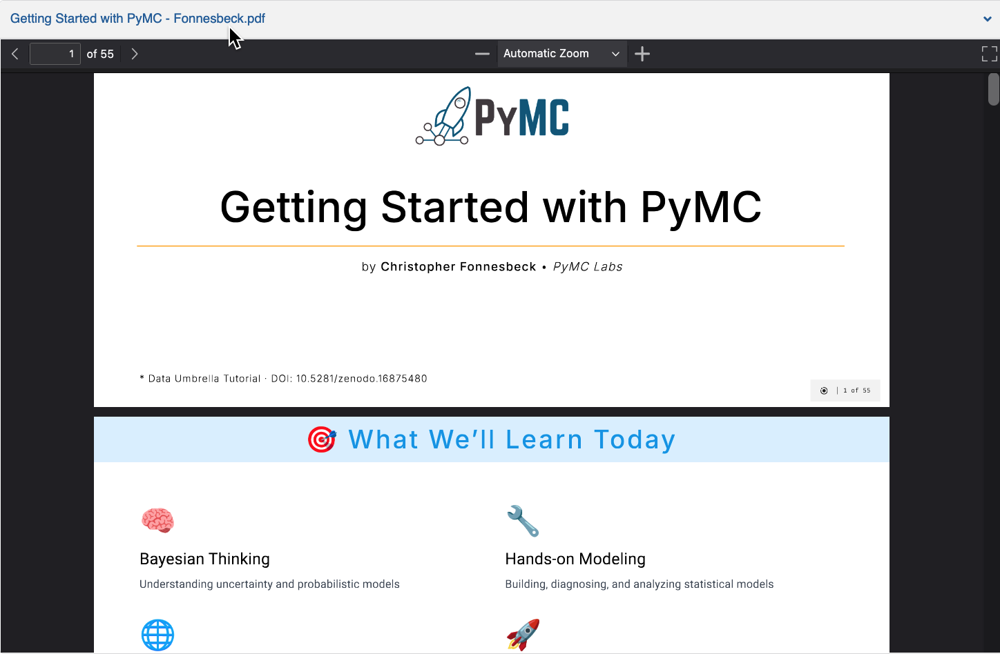

(getting_started_with_pymc)=
# Getting Started with PyMC

:::{post} September 24, 2025
:tags: events, community, talks
:category: news, testimonial
:author: Reshama Shaikh, Chris Fonnesbeck
:image: 0
:exclude:

Chris Fonnesbeck presented fundamentals, tips and best practices for using PyMC. 
:::

## [Slides](https://zenodo.org/records/16875480)

## About 

This one-hour presentation introduces new and existing users to version 5 of PyMC, a powerful Python, open source library for probabilistic programming and Bayesian statistical modeling. Learn the fundamentals of PyMC, best practices for installation and setup, and gain hands-on experience building their first Bayesian model.

## Video

 
<iframe width="560" height="315" src="https://www.youtube.com/embed/jrU0UBr2z3k?start=230" title="Getting Started with PyMC" frameborder="0" allow="accelerometer; autoplay; clipboard-write; encrypted-media; gyroscope; picture-in-picture" allowfullscreen></iframe>
 

## References

- Slides: [Getting Started with PyMC](https://zenodo.org/records/16875480)
- Video: [Intro to Probabilistic Programming](https://youtu.be/Qu6-_AnRCs8)
- [PyMC video playlist](https://www.youtube.com/playlist?list=PLBKcU7Ik-ir99uTvN0315hIVLuyj4Q1Gt)
- [Contributing to PyMC](https://www.dataumbrella.org/open-source/contributing-to-pymc)
- Connect with PyMC
    - Website:  [pymc.io](https://www.pymc.io)
    - Discourse: [discourse.pymc.io](https://discourse.pymc.io)
    - YouTube: [PyMCDevelopers](https://www.youtube.com/c/PyMCDevelopers)
    - Star GH repo:  [pymc-devs/pymc](https://github.com/pymc-devs/pymc)
    - Join Meetup: [pymc-online-meetup](https://www.meetup.com/pymc-online-meetup/)
    - LinkedIn: [@pymc](https://www.linkedin.com/company/pymc/)
- [ArviZ](https://www.arviz.org/en/latest)
- [NumPyro](https://num.pyro.ai/en/stable)
- [uv](https://docs.astral.sh/uv/getting-started/installation)

## Timestamps

- [00:00](https://www.youtube.com/watch?v=jrU0UBr2z3k) Data Umbrella introduction  
- [03:50](https://www.youtube.com/watch?v=jrU0UBr2z3k&t=230s) Chris F begins presentation  
- [05:42](https://www.youtube.com/watch?v=jrU0UBr2z3k&t=342s) Agenda / outline  
- [06:18](https://www.youtube.com/watch?v=jrU0UBr2z3k&t=378s) What is PyMC?  
- [07:37](https://www.youtube.com/watch?v=jrU0UBr2z3k&t=457s) Why Bayesian modeling?  
- [08:58](https://www.youtube.com/watch?v=jrU0UBr2z3k&t=538s) Real world applications  
- [10:08](https://www.youtube.com/watch?v=jrU0UBr2z3k&t=608s) Installation and setup  
- [12:20](https://www.youtube.com/watch?v=jrU0UBr2z3k&t=740s) Sampling backends and libraries  
- [12:40](https://www.youtube.com/watch?v=jrU0UBr2z3k&t=760s) Q: what about uv for installation?  
- [13:32](https://www.youtube.com/watch?v=jrU0UBr2z3k&t=812s) Q: what is the recommended installation for HPC?  
- [16:28](https://www.youtube.com/watch?v=jrU0UBr2z3k&t=988s) Test your installation  
- [17:00](https://www.youtube.com/watch?v=jrU0UBr2z3k&t=1020s) Trouble shooting common issues  
- [19:42](https://www.youtube.com/watch?v=jrU0UBr2z3k&t=1182s) Performance: BLAS backends  
- [20:29](https://www.youtube.com/watch?v=jrU0UBr2z3k&t=1229s) PyMC fundamentals- Bayes Theorem and the Computational Challenge  
- [21:57](https://www.youtube.com/watch?v=jrU0UBr2z3k&t=1317s) MCMC inference method (the model container, random variables and distributions)  
- [25:22](https://www.youtube.com/watch?v=jrU0UBr2z3k&t=1522s) Observed data  
- [26:09](https://www.youtube.com/watch?v=jrU0UBr2z3k&t=1569s) Data handling pitfalls (NumPy, pandas, polars, dataframes; missing data)  
- [27:47](https://www.youtube.com/watch?v=jrU0UBr2z3k&t=1667s) ArviZ: diagnostics and visualization  
- [28:58](https://www.youtube.com/watch?v=jrU0UBr2z3k&t=1738s) Building your first model  
- [31:20](https://www.youtube.com/watch?v=jrU0UBr2z3k&t=1880s) Models dims and coords  
- [32:23](https://www.youtube.com/watch?v=jrU0UBr2z3k&t=1943s) Common modeling errors  
- [33:35](https://www.youtube.com/watch?v=jrU0UBr2z3k&t=2015s) Prior predictive check 
- [34:49](https://www.youtube.com/watch?v=jrU0UBr2z3k&t=2089s) Sampling the posterior  
- [35:50](https://www.youtube.com/watch?v=jrU0UBr2z3k&t=2150s) Trace plots: checking convergence; posterior distributions, parameter relationships, model summary table  
- [40:35](https://www.youtube.com/watch?v=jrU0UBr2z3k&t=2435s) Common pitfalls and solutions (convergence diagnostics, divergences, diagnosing sampling problems)  
- [44:19](https://www.youtube.com/watch?v=jrU0UBr2z3k&t=2659s) Performance optimization (prior specification problems)  
- [47:11](https://www.youtube.com/watch?v=jrU0UBr2z3k&t=2831s) Debugging workflow
- [48:49](https://www.youtube.com/watch?v=jrU0UBr2z3k&t=2929s) Bambi: high-level modeling  
- [49:33](https://www.youtube.com/watch?v=jrU0UBr2z3k&t=2973s) PyMC-Extras: Cutting edge  
- [50:25](https://www.youtube.com/watch?v=jrU0UBr2z3k&t=3025s) Community & learning resources (+ PyMC example notebooks)  
- [54:05](https://www.youtube.com/watch?v=jrU0UBr2z3k&t=3245s) Future direction of PyMC  
- [56:30](https://www.youtube.com/watch?v=jrU0UBr2z3k&t=3390s) Community & Process  
- [57:40](https://www.youtube.com/watch?v=jrU0UBr2z3k&t=3460s) Q: what program did you use to create the slides? [https://sli.dev](https://sli.dev)  
- [58:50](https://www.youtube.com/watch?v=jrU0UBr2z3k&t=3530s) Q: is PyMC using NumPy v2.0? (Answer: yes)  
- [01:00:13](https://www.youtube.com/watch?v=jrU0UBr2z3k&t=3613s) Q: why use the context manager?  
- [01:01:02](https://www.youtube.com/watch?v=jrU0UBr2z3k&t=3662s) Q: How can I evaluate whether my model has too many parameters?  

## Transcript

### [00:00](https://www.youtube.com/watch?v=jrU0UBr2z3k) Data Umbrella introduction  

Hi, everybody. Welcome to Data Umbrella's webinar. I'm going to do a brief introduction, and then Chris will present. You can ask questions and we'll stop. When is a good time to stop to get those questions answered, and this is being recorded. About Data Umbrella, if you're new to the community, we organize data science and open-source events for the community. We are about five and a half years old now. This is our team. My name is Reshama. I'm based in New York City. There's Beryl also who is based in Nairobi, and Sangam who is based out of India. This is the team that makes all of these webinars happen. We have a code of conduct and we thank you for helping to make this a welcoming, friendly community for all that people want to keep returning to. There are various ways to support Data Umbrella. The first is if you could share events with others, we would really appreciate it. We have some projects on our GitHub for timestamps and website and blogs and such. Feel free to explore that. You can also donate to our nonprofit. We're on every.org as Data Umbrella. We have a YouTube channel with a really rich library of open-source and data science events. This is just a sampling. We have a lot of playlists. One of them is career advice. We have data visualization, we have Scikit-learns, contributing sprint. We also have a series for PyMC and NumPy. We also have a monthly newsletter. It's at dataumbrella.substack.com. We are more likely to be quieter on the newsletter than to actually spam you. Feel free to sign up. I'll share the link and you can get updates about what's happening in the community of Python and data science and open source, as well as what Data Umbrella is up to. This is a QR code with some of our most commonly used social media platforms. 

We use Big Marker as our platform here. At the very top, you may see two letters called CC for closed captioning. If you'd like a live transcript, you can click on that to get that, and you can also pick from a language if you prefer. For those of you who are new to the Data Umbrella Meetup Group, I'll share the link, but if you want to join our upcoming events, that's the first place to find out about the events. We also have an online suggestion box, and I'll share the link in the chat. If you have suggestions for future event topics or feedback on this event, or you want to share any technical issues that you might have experienced, let us know. 

### Introducing Chris Fonnesbeck

Today's talk is a tutorial for getting started with PyMC. Our speaker is Chris Fonnesbeck. Chris is a Principal Quantitative Analyst at PyMC Labs and an Adjunct Associate Professor at Vanderbilt University Medical Center, with 20 years of experience as a data scientist in academia, industry, and government, including seven years in pro baseball research with the Philadelphia Phillies, New York Yankees, and Milwaukee Brewers. He's interested in computational statistics, machine learning, Bayesian methods, and applied decision analysis. He hails from Vancouver, Canada, and received his PhD from the University of Georgia. You can find Chris on LinkedIn, GitHub, and Bluesky. With that, I will turn over the microphone and the screen share to Chris. 

### [03:50](https://www.youtube.com/watch?v=jrU0UBr2z3k&t=230s) Chris F begins presentation  

Fantastic. Thank you. I will throw on my screen here. Welcome everyone. I'm excited to present all of this to you. This is going to be a slightly different talk than I usually give. By that, I mean it's going to be a little bit, really, if you've seen any of my PyMC talks before, they tend to be technical. I tend to teach everybody how to the background in Bayesian inference, and how to build sophisticated models using various inference methods in PyMC. Today is really more of a getting to know you talk, and to give yourself a little bit of familiarity with the package, and also to understand some of the things that can go wrong along the way when you're trying to set PyMC up on your device, and the sorts of problems that you encounter while you use it. I will, of course, get into the nitty-gritty of how to actually build a model, but I'm not going to dig into the heavy math of Bayesian inference here. There are a lot of resources to help you with that aspect. You can sit back and enjoy, relax. This shouldn't be too strenuous on the brain, and hopefully you'll gain a little bit of knowledge about how to smoothly get up and running with PyMC on your own after the talk is over. I'll also talk about the broader PyMC ecosystem, related libraries in Python, and a little bit about what we're planning to do with PyMC in the future. Let's get rolling. We'll talk a little bit about Bayesian thinking here, understanding how to think in terms of uncertainty and priors and beliefs, and so on. We'll do a little bit of hands-on modeling. Not really hands-on, actually, that's a little bit misleading, but I'll show you how to construct a simple model with some real, albeit small data. Yeah, look at the ecosystem, and then really a running theme throughout is best practices, all the way from installation through to iterating on your model and improving the output that you get. 

### [06:18](https://www.youtube.com/watch?v=jrU0UBr2z3k&t=378s) What is PyMC?  

I'll answer the "What is PyMC?" question. I assume you know already since you're here, but this is really where statistics meets probabilistic thinking meets Python. The idea behind PyMC is to make Bayesian modeling accessible to applied users, not necessarily statisticians, but scientists of every stripe. We try to do that by having a really intuitive API for specifying models using pretty standard Python syntax, but under the hood, having state-of-the-art algorithms for fitting Bayesian models, because that can be difficult computationally, high-performance backends for doing things like automatic differentiation, some visualization tools through related packages like ArviZ. We want to think of it as a way of building models that handle uncertainty in the form of probabilistic modeling at every step of the way. Why are we doing Bayesian modeling? Well, if you think of traditional, frequentist, classical statistics, the sorts that we would learn in college, at least when I went to college or even taught statistics in college, it was focused very much on hypothesis testing, so getting point estimates from estimators for things, inference using hypothesis testing via p-values, generating confidence intervals. The Bayesian approach, on the other hand, gives you full probability distributions associated with parameter values that you're trying to infer, making direct probability statements. You're able to say that with a 95% interval, there's a 95% chance the true value is between X and Y. You can't say the same for traditional confidence intervals. You can incorporate prior knowledge from other studies and other information naturally into your model, and you get uncertainty quantification for free. So we hope that the Bayesian approach answers the questions that you actually want to ask about your data and more specifically about your model. 

### [08:58](https://www.youtube.com/watch?v=jrU0UBr2z3k&t=538s) Real world applications 

These days, Bayesian methods took a few decades longer than classical statistics to gain traction in real-world applications, but now even just with applications we see with PyMC, never mind other packages like Stan and NumPyro and TensorFlow probability, it's used virtually in every industry and scientific field because uncertainty is everywhere and people worry about quantifying uncertainty. So there's health care applications, clinical trials that use Bayesian methods nowadays, drug dosing, epidemiological models, finance, genetics and other non-medical biology, things like protein structure, systems biology, lots of applications in tech and physics. My personal favorite, sports analytics, it's used throughout Major League Baseball for sure, as well as other sports. So PyMC is used wherever uncertainty quantification matters. 

### [10:08](https://www.youtube.com/watch?v=jrU0UBr2z3k&t=608s) Installation and setup  

So let's start with something practical rather than theoretical, and that is how do you get PyMC installed onto your machine? This is some of the, you know, it's getting easier than it used to be. Package management in Python, as some of you are aware, has evolved greatly over the years and it's things have become easier. And we do have this written up pretty well on the PyMC website on GitHub. But our current recommended installation is to use the Conda package manager and install the package from the Conda Forge repository. This is the best way of handling its numerical dependencies, notably BLAS and LAPAC. It uses precompiled binaries to avoid any compilation issues you may have, and it has consistent versions across the Python stack. So this would install Conda into an already existing Conda environment. If you wanted to create a fresh Conda environment and add PyMC to it, you would do this. This would isolate it a little bit from other things that you may be doing with other Conda environments, and it will install a compatible version of PyMC, which tends these days to be greater than version 3.10. Now, that's the official recommendation. I tend to use PIXI nowadays, and we may trend towards recommending this in the future. I like PIXI's a slightly more modern package manager that's gaining popularity. It's really good for cross-platform package management. It uses Conda Forge for most of its packages. You're getting kind of the goodness of the Conda packaging. It creates really good reproducible environments. And I find it to be faster and slightly more reliable than traditional Conda. But your mileage may vary on that. 

### [12:20](https://www.youtube.com/watch?v=jrU0UBr2z3k&t=740s) Sampling backends and libraries  

One of the key benefits and challenges to PyMC is the fact that it has several different computational backends and associated libraries for doing inference. And inference typically is done in PyMC using Markov chain Monte Carlo methods. 

### [12:40](https://www.youtube.com/watch?v=jrU0UBr2z3k&t=760s) Q: what about uv for installation?  

Reshama:  Chris?  
Chris: Yes.  
Reshama:  If I may interrupt.  
Chris: Absolutely.  
Reshama: What are your thoughts about UV?  
Chris:  
UV, yeah, UV is also sort of side by side with PIXI gaining popularity as an installer. My main reservation about using that here is that, of course, UV uses pip to install its packages, and pip is where we generally see problems, particularly on the Mac side installing things and mostly getting the dependencies right. So UV is going to do the same sorts of things as pip. Again, your mileage may vary so people can figure it out. But I would attend towards PIXI, but I may be personally biased on that issue. 

Reshama: And another question just related to installation is, what's the recommended installation mode for HPCs? 

Chris:  
And I assume that's high-powered computing that do not allow conda. And for this is, I don't think many have PIXI yet. Yeah, well, I mean, PIXI is really easy to install. It's a script that will run that will install it into your local library. So you don't have to install it system-wide. So you should be able to install that on HPC. But you may be stuck building and compiling it yourself, which takes a little bit more support. And so you would consult the documentation and certainly the online resources for PyMC to help you do that. But the nice thing about PIXI is that you can just install it locally and not system-wide. And you should be able to do that with conda as well. But I understand that some platforms and some at work, you may not be allowed to install arbitrary Python environments. So there are challenges. But these recommendations would be for you on your personal laptop or computer or to any machine that you would have administrative rights to or software installation rights to. Good, thanks for those questions. And yeah, keep them coming. 

#### Sampling Backends

So yeah, a lot of different sampling backends. So these are computational backends that affect the performance of PyMC and how quickly and efficiently and with which algorithms we use to fit models. PyTensor is our default backend. Most of it, most of the sample is actually written in pure Python. PyTensor is a framework based on what used to be a project called Theano, which is a deep learning library that we've adapted to do Bayesian methods. It's CPU-based. It compiles by default to C. The nice thing about it is it works everywhere and it supports all the features in PyMC. So it's currently our default. But you can see there are three other backends here. Nutpie, which one of our developers, Adrian, came up with that is Rust-based, which comes with a performance boost. It can run on CPU and GPUs via JAX. And then NumPyro has a gradient-based MCMC sampler that's very, very good that is built on JAXs. So that's good for running on GPUs particularly. There's another library, independent library called BlackJAX, which has a lot of modern MCMC methods. I don't think it's very well maintained anymore. Apologies if that's not true, but it doesn't get updated very quickly, very frequently, I should say. So we do tend to prefer the NumPyro or Nutpie backends if you want to do more advanced stuff. 

### [16:28](https://www.youtube.com/watch?v=jrU0UBr2z3k&t=988s) Test your installation 

And testing your installation is really a matter of just importing the libraries. PyMC, SPM is the usual alias. Related packages like ArviZ for doing visualization and diagnostics as ArviZ. And if things go well and you're able to generate a sample without an error, then you're ready to go. And we should be on PyMC version 5.0 something these days. 

### [17:00](https://www.youtube.com/watch?v=jrU0UBr2z3k&t=1020s) Trouble shooting common issues 

Our discourse page, discourse.PyMC.io, is full of troubleshooting discussions. I tried to harvest some of the most common ones. No surprise, Windows users have issues sometimes getting things installed. The biggest issue is the G++ compiler. And if it's not installed correctly, you can take a huge performance hit. So you have to install this M2W64 toolchain in order to fix that. That's kind of the big one on Windows. Offscript, I would really recommend using WSL, Windows System for Linux, on Windows if you can. I used to use Windows quite a lot, and that was my preferred method. Allows you to run Linux inside of Windows, and then you avoid some of the Windows-related issues. But yeah, installing and setup, again, if you're on a Mac, using the CondaForge packages is recommended. I would avoid running with installing under pip, as I was saying before. 

A lot of the issues that you come across will have to do with what we call shapes and dims. So the shapes of our variables and the dimensionality of our variables, and we try to add them or multiply them together, they do unpredictable things if they don't line up. So when you multiply things together in PyMC, it is element-wise multiplication, not matrix multiplication. You've got to use dot for matrix multiplication. So you've got to keep your dimensions and coordinates consistent. You get errors related to something called bad energy, which means it's having bad initial energy, which means it's having trouble starting up or getting going with its MCMC sampling. And this is a matter of just checking your model, making sure that your priors are constrained appropriately. I'll talk about this a little bit later, trying different adaptive initializations in your MCMC sampler. And there are documentation on the website for that as well. The big thing is some folks are still installing PyMC v3. So before version 4 of PyMC, the project was called PyMC 3. And so you can still pip install PyMC 3. You've got to make sure that you just install PyMC without the 3 after it. A lot of the version 3 code works with minor tinkering, but we do recommend making sure you're on the latest documentation there. And one of the main things you'll see, particularly on Macs, if you don't install the numerical dependencies properly, is this error that says you're using the NumPy CAPI. And it means that you're not using the BLAST back end, which is the accelerated optimized computational back end. And that's when you really want to make sure you're installing via Conda, unless you really know what you're doing. If you're on an Intel Mac platform, you want to use the MKL builds, which are in Conda Forge. If you're on Apple, again, on Conda Forge, you'll get the open BLAST versions instead. So just quickly, some PyMC fundamentals, assuming that we have things installed properly. 

### [20:29](https://www.youtube.com/watch?v=jrU0UBr2z3k&t=1229s) PyMC fundamentals- Bayes Theorem and the Computational Challenge 

I just want to go over a few core concepts. I try to completely eliminate equations from this talk, but I have to show you Bayes theorem. Otherwise, they take away my Bayesian membership, my Bayesian teaching license. So here it is for those of you unfamiliar. So the whole point here is that you're making inference about a model or parameters of a model. We'll call these theta. It could be a whole set of parameters in your model. And then you have obviously some data that you want to bring to bear on estimating these things. And so the goal here is to come up with this posterior distribution, P of theta given data. It's called posterior because it's what we believe about theta after we've observed all the data. And Bayes theorem is the estimator, essentially. So we take prior distributions for all of our unknown parameters. We update it with the likelihood and we get this posterior distribution. That's kind of the math. That's the Bayesian update prior to posterior. And the big challenge is that this denominator, which is essentially a normalizing constant in Bayes theorem, looks innocuous enough. But the big computational challenge is that this is just the numerator integrated over all of the thetas. So if you've got a model with even a handful of parameters, if not dozens, hundreds or thousands, this becomes intractable. You can't do it. 

### [21:57](https://www.youtube.com/watch?v=jrU0UBr2z3k&t=1317s) MCMC inference method (the model container, random variables and distributions)  

So this is where we need advanced inference methods like Markov chain Monte Carlo. Markov chain Monte Carlo is a way of generating samples from the posterior without computing that nasty denominator. So it works just with this unnormalized posterior. That proportional to symbol there in the equation means that it's proportional to the likelihood times the prior, but not exactly. And so MCMC gives us posterior expectations, all the intervals we want, all the predictions we may need. And Pimsey has several really efficient state of the art samplers that are that helps us do that. And we're not going to dig into MCMC here. We're really just going to teach you how to build a model and run it. And there are, again, given many, many talks on MCMC and how that's used in Pimsey. So you can look those up a little bit later. So Pimsey models look like this. We kind of overload, if you like, the context manager in Python, which is this with statement. It's usually used for things like network resources or opening and closing files. Here we use it to instantiate a model and then inside this with block, we specify all of the components of the model. And of course, we saw we flipped back here. Let's go right here. All we need to specify as a user is P data given theta, which are our likelihoods and P theta, which are our priors. So here's the simplest possible model, an unknown mu, a mean, and then some data that is modeled as a normal distribution. And we're trying to here estimate the unknown mean called mu. And that's kind of at a high level what it looks like. Slightly larger model here. We have different sorts of random variables and distributions that are available in Pimsey. Here's a normal for a mean. Here's a half normal for a standard deviation. And then we have methods you can you can generate arbitrary deterministic transformations of whatever variables that you specify. So if I'm interested in scaling mu, I can multiply it by two. Now I have a thing called scaled mu. And you can always draw or generate a graph called the directed acyclic graph that is your Bayesian model. And that's the thing that we're going to reason over and generate samples from using MCMC. Pimsey comes with an enormous array of distributions. This is kind of the art to Bayesian modeling, in my opinion. This is kind of what takes a little bit of practice and a little bit of experience. And that is choosing from dozens of potential distributions to model your unknown parameters and your data. And Pimsey has a whole bunch built in, depending on whether you're modeling a probability or rates or measurements from a population of some kind. There's a distribution in there for you. And if there isn't, you can always add it. It can be Pimsey can be extended for arbitrary probability distributions relatively easily. The data is injected into a model using just a normal, well, in this case, an actual normal, but using standard probability distributions. 

### [25:22](https://www.youtube.com/watch?v=jrU0UBr2z3k&t=1522s) Observed data

The only difference here is that we use this observed argument where the data is injected essentially into the model. So that makes it a likelihood rather than a prior or some other type of the distribution. Shape of your data has to match that of the distribution. So if you have a multivariate normal likelihood, you have to have data that is at least two dimensional. So the likelihood is the way of linking your data to the rest of your model and the other parameters. 

### [26:09](https://www.youtube.com/watch?v=jrU0UBr2z3k&t=1569s) Data handling pitfalls (NumPy, pandas, polars, dataframes; missing data)  

Some of the common pitfalls. **Avoid using pandas.** I know we like to use pandas and these days, polars to manipulate our data, but you really want to be working with NumPy arrays and matrices here. Everything gets converted into tensors, into.. with the computational backend, PyTensor, not on data frames. So extract the NumPy variables using the values attribute on pandas. It's useful to use data wrappers for data that will change. So we make it possible to specify data as bonafide objects in the model graph. And what that allows us to do is to swap out, let's say, fitting data or training data with testing data or prediction data without completely rewriting our model or having to do anything special with it. So we recommend using PM data objects where you can handle missing data. We want to use where functions. So PyMc has access to all of PyTensor's math library. Math functions inside of PM data relatively easily that way. 

### [27:47](https://www.youtube.com/watch?v=jrU0UBr2z3k&t=1667s) ArviZ: diagnostics and visualization  

ArViz is a really handy package that gets installed alongside of PyMc as a dependency when you install it. It provides a storage backend for our samples from MCMC sampling. And then it also gives us access to a wide variety of visualization and diagnostic tools for monitoring MCMC convergence, identifying problems, plotting either individual or vectors of parameters and making it really easy to do model checking and iteration. So this is all just part of what I would call a seamless Bayesian workflow. You build and fit your model with PyMC. It generates an RVs data structure called an inference data object. And we can hand that over to ArviZ for doing any number of diagnostic plots, model comparison and generating publication quality plots. So let's do a quick kind of real world model here. This is one we use quite a lot. It's a bit of a gruesome problem example. This is a bioassay problem. So this is a drug dose being applied to sets of rats at different dosages. So dose here is a log dosage, which is why we have negative numbers here. And we have four groups of five rats. And then we have a certain number of reported deaths. And as you can see, as the dosage increases, the number of deaths increases. And so we want to this is your classic dose response modeling problem here. And it's a really easy way to show off PyMC and how it's really easy to implement a simple model here. So this is kind of what it looks like. So there's the data converted into numpy arrays, as I recommended. 

### [28:58](https://www.youtube.com/watch?v=jrU0UBr2z3k&t=1738s) Building your first model  

And then there's the model, the model statement, the context manager. Here are our data statements. So we got one for X, which is the dose and one for Y, which is the deaths. So those are wrapped and they'll be used further down. And then our what we're going to do here is model an intercept and a slope, just like a regression problem. We'll call one alpha and one beta. And then here's the kind of the logistic regression that we're going to use to fit things here, because we're interested in the probability of death, right? A proportion, an expected proportion of deaths at a given dosage. We have to transform a linear regression projector into a probability using the inverse logit transformation. So here's our PM dot math again. This will convert something that is defined on a real line, which is alpha plus beta times the dose into what we'll call theta here, which is a probability. And then we pass that to a binomial likelihood, which models the number of deaths per the population. In this case, it's five for each of them. That's kind of your simplest possible, you know, time see model, little logistic regression. And again, for, you know, kind of for each line of math that you would have if you were writing this down on a whiteboard, you have a line of Python code. So it's just a handful of lines here. 

### [31:20](https://www.youtube.com/watch?v=jrU0UBr2z3k&t=1880s) Models dims and coords  

One way that another alternative here is to that we recommend when you have multidimensional or even vector valued parameters is to use labeled dimensions. Right. So what I'm going to do here, this is exactly the same model, except instead of alpha and beta, I'm just going to call the regression parameters beta and they're going to be it's going to be of length two. And you'll notice here I put DIMS equals co-effs coefficients. And up here I have a set of coordinates. And notice these are just labels, ones for the intercept and one for one is for the slope. And and then we just index out beta naught and beta one. Everything else is exactly the same. I have the same thing for the observations here. I have a length four because we have four groups of rats. And that's going to be the dimensionality of of why in this case, what this will do is allow us to generate plots that have labels automatically without you having to infer what zero and one mean, for example. 

### [32:23](https://www.youtube.com/watch?v=jrU0UBr2z3k&t=1943s) Common modeling errors  

Some common modeling errors that we get here. Shape mismatches is a huge one. Shapes shapes are hard, as we like to say in the PyMC dev team. Making mismatching dimensions between variables. We try to generate informative errors where we can to help you debug these things. But you really just have to be vigilant. It's, again, really useful generating these these plots with model two graphies because it does show you the size of each variable. Notice there are there's a little plate here with five by why, which means there are five data points. So that can be really helpful in debugging some of this stuff. And then associated with that broadcasting issues. Right. So you can multiply a scalar by a vector, but you can't multiply a vector of length two by a vector of length three. You get an error. So it's really important to check the shapes of your variables explicitly when things go wrong. 

### [33:35](https://www.youtube.com/watch?v=jrU0UBr2z3k&t=2015s) Prior predictive check 

And then one of the nice things that you're able to do as part of sort of a model checking regimen is to do what we call prior predictive checking. So you take your model that you've just specified, this guy, and you you call sample prior predictive and it generates what it does is it draws samples from all your priors and then draws in this case, binomial variables based on those prior samples. And this is essentially showing what your model is saying before it's seen any data. And notice these lines go all over the place. Some are increasing, some are decreasing, some are flat, some go all the way up to one and some don't, some go all the way down to zero and some don't. It's essentially saying that we're ignorant, right? We haven't seen any data. We don't know what this dose response looks like. So in this case, it's pretty good. And it's and notice it's not going outside of zero one. All right. Everything is properly transformed to be probabilities. So this is a nice little check to see that things are behaving themselves, that we're not saying anything about the universe that we're trying to model that we don't think is reasonable a priori. 

### [34:49](https://www.youtube.com/watch?v=jrU0UBr2z3k&t=2089s) Sampling the posterior  

OK, and then we call PM dot sample and PyMC makes MCMC sampling pretty much automatic. I'm going to do MCMC sampling here with no arguments. There are some really reasonable defaults that for particularly for a problem of this size will give you a really good sample. And so you'll get some output in your terminal. It'll notice it'll auto assign a sampler of the variety of samplers available. It'll initialize things appropriately for you. And then you can see that it's it's doing this what's called a nuts algorithm, the no U-turn sampler for the two unknowns in our model, alpha and beta. And it says we sampled four chains for a thousand tuning and two thousand iterations. OK, and then you pick the number of samples to. So it automatically picked your sampler, ran parallel chains, tuned the hyper parameters for you and it monitored for sampling issues. If we had sampling issues, you'd get a bunch of warnings in here, which are very helpful. And what do we get? We get these samples that should resemble a sample from the true posterior distribution. 

### [35:50](https://www.youtube.com/watch?v=jrU0UBr2z3k&t=2150s) Trace plots: checking convergence; posterior distributions, parameter relationships, model summary table  

So this is an ArviZ plot called plot trace. It generates just basically two different ways of looking at the same output. So these are the samples from alpha and beta, one shown as a KDE. And there were notice we remember back here, if we flip back, it said sampled four chains. So there are four lines here, each in a different style. There's very close together, which makes them hard to read. But it's actually a good diagnostic because all of the chains have kind of converged to the same area in the parameter space here. And you see, you get this what we call a fuzzy caterpillar over here. Right. There's no trend here. It's the variance is not changing as the time series moves along. These are really good visual diagnostics. They should look just like essentially like white noise centered at a particular value that we hope is the true underlying mean of the distribution. OK, and we get things like, you know, intervals. HDI stands for highest density interval. It's a credible probability or credible interval. There's a 94 percent chance that the true value for alpha is somewhere between is between point negative point nine eight and one point four, for example. You get these nice publication quality graphs. They're nicely labeled according to the variable name. You can generate scatter plots to see, you know, whether or not there's a correlation between them. Looks like there's a slight, maybe slight negative correlation between the alpha and beta. So each point here is a draw from the posterior. The same one that we saw in those other two diagrams. They're now just plotted together as a scatter plot. So this is a nice way to visualize things we can generate a model summary table using our summary that gives us a bunch of diagnostics that are very useful. And these ones turned out to be quite good. Our hat is a convergence diagnostic. It should converge to around one when the model is converged to hopefully to the posterior. 

ESS stands for the effective sample size. Remember, we drew what four thousand to four chains of two thousand. So there is about eight thousand samples. The effective sample size due to autocorrelation is always going to be smaller than eight thousand. But we want it to be at least in the thousands, at least several hundred, ideally more than a thousand, but at least more than about four hundred, according to the literature. So these are good diagnostics. And then we can visualize this so we can draw dose response curves from our posterior distribution. Each blue line here is a candidate true dose response curve. And you see that they're all kind of clustered around the posterior mean. And the red points are that are the actual number of proportions, in this case, of death in the groups. So it looks like we did a pretty reasonable job of estimating this unknown model. And then, of course, we always want to make predictions. And remember, we we use those data containers before when we specified dose and deaths. And so when we want to make predictions at arbitrary points, we can do this really easily. We've got a set of new doses and I, again, arbitrarily picked negative one zero and positive one. And then all we need to do is crack open our model again with the with statement and then call set data with our new values for dose. And then we call sample posterior predictive. Remember, before we used sample prior predictive to generate prior predictive samples. Well, these are posterior predictive samples and we're not fitting the model again. The model has already been fit. What we're going to do now is draw values not from our prior, but from our posterior parameters, push them through the binomial distribution and draw binomial samples and get actual simulated data sets. And so you can see these vertical lines here show the ranges of predicted values at those points, negative one zero and one showing what we would expect in terms of proportions of death at those doses. So we've gone the full we've done sort of the full range here, starting with raw data, an idea about a model all the way to making fitting the model and making predictions. As ever, lots of even with a high level modern tool like PyMC, Bayesian models can go wrong. You're handwriting a model here. This isn't kid stuff. It's it can get hard, particularly when you get beyond individual sort of simple models like this. 

### [40:35](https://www.youtube.com/watch?v=jrU0UBr2z3k&t=2435s) Common pitfalls and solutions (convergence diagnostics, divergences, diagnosing sampling problems)  

So convergence diagnostics is the biggest one. Like, you know, did this work? Did MCMC work? How do I know that this algorithm worked the way we advertised it? Well, I showed you our hat values. You want them to be close to one. That's a good sign if they are effective sample size being long enough, large enough. The fuzzy caterpillar is what we call good mixing that the sampler is exploring the distribution, the posterior distribution. Well, we have these things called divergences occasionally. The nuts algorithm uses gradient based methods to kind of efficiently explore the posterior distribution. And it's based on a physical model of kinetic versus potential energy. And sometimes that that path can diverge. And basically it's like a satellite spinning out of orbit and you'll get values that are far, far away from the anywhere near the true posterior distribution. They're called divergences. And you get these messages sometimes saying there were five hundred and forty seven divergences after tuning. And this means that your sampler is having some problems and the resulting sample may be biased and hence your inference may be biased. If you get a handful of them, one or two, maybe it doesn't even. We don't worry too much. But when you have a lot, you want to start exploring ways of fixing it, which we'll talk about here in a second. 

You also sometimes will get errors called that report a bad initial energy. This means that the model is starting at a bad place. The model starts at an arbitrary space in the arbitrary location in the parameter space. And sometimes it's good. Sometimes it's bad. There are ways of initializing that you can hand specify initial values for your parameters. We used to recommend doing something called find map, which calculates the maximum a posteriori estimate, essentially the mode of the posterior. That turns out to be a bad place to start for a variety of reasons I won't get into here. So we don't recommend that anymore. What we recommend instead is changing the initialization method. There are a bunch of different ones that we'll see in the documentation. Adapt, diag, jitter plus adapt, diag. They're just different strategies for initializing it. And sometimes just more or less randomly changing that will fix it for your particular problem. And then divergences sometimes divergences can be tuned away by increasing the target acceptance rate, which by default is about 80 percent up to around 90 or 95 percent. Sometimes you need to go back and transform parameters in your model or reparameterize your model, which is harder to do. So step one is the easy way. Step two is the hard way. The hard way is better if you know how to do it. But the easy way is easier and it's easier to do in just kind of a single step. So your mileage may vary on both of those, depending on your problem. We can also optimize the performance. I said earlier on that by default we use the PyTensor C backend, which is not the fastest. It's just generally the most reliable across platforms. But if we swap back ends and use NumPyro or NutPy, for example, we can get a boost on a lot of models, several fold, particularly if we use a computational backend like a GPU. So we can get big, big speed ups. NutPy uses the Numba just in time compiler by default on CPUs that can get a big boost as well. So there are ways of making your model run faster with relatively little effort. 

### [44:19](https://www.youtube.com/watch?v=jrU0UBr2z3k&t=2659s) Performance optimization (prior specification problems)  

Some of the problems that we run into have to do with misspecifying priors. Like I said, this is the art of doing Bayesian inference is picking appropriate distributions for all of your various random variables, likelihoods and so on. This is where you get some of these bad energy errors. So, for example, let's say you had a parameter sigma, which is typically used to represent a standard deviation or variance. If we sort of blindly apply a normal distribution, which is sort of the default distribution across statistics because normal distributions are so common. The problem with that is that it allows negative values, right? Negative one is a perfectly plausible draw from a normal distribution, but you can't have negative standard deviations. And so you'll run into issues. Sometimes the model will run, but it won't run efficiently or you'll get these these bad initial energy errors and you won't even be able to get started. So you want to use proper constraints. So consider a half normal instead. This is just a normal that's truncated at zero and it only has the positive part of that. So you notice there's no mean here. It's just a standard deviation of five. OK, so some common choices here are things like any sort of half distribution like half normal half Cauchy are good for standard deviations. Probabilities that need to be constrained to zero one. Well, you can put a uniform on those if you really know nothing about the probability or you can use a beta distribution rates which have to be also positive. We typically use things like gamma distributions, exponential distributions. Whereas, you know, regression coefficients, you know, they can generally be positive or negative. You can have positive or negative relationships. So you might use a normal for that one. Always do prior predictive checks. That's what this is good for. It'll show you if you're implying something really weird by your model specification. And you can usually use that to guide your choices. 

### [47:11](https://www.youtube.com/watch?v=jrU0UBr2z3k&t=2831s) Debugging workflow

So kind of a debugging workflow here is, you know, follow those, use those diagnostic steps which start from the simple to the complex and go to the complex. So, you know, read the tea leaves, look at your trace plots. What does the sample look like? Is there anything weird going on there? Then generate that summary table and look at your values and your effective sample sizes. Did you get any divergences? And then do posterior predictive checks. What is your model saying after you fit it? When things go wrong, there can be a strategy, a workflow for fixing it as well that goes from the simple to the complex. You can try tuning your sampler. We have guidance on our documentation on how to do that. Look at those prior predictive samples. Try to simplify your model. Biggest mistake that I see users make, even experienced users, is they try to build a complex model right out of the gate. Start with a simple model, even a cartoonishly oversimplified unrealistic model, and then expand it as you get things going and slowly make things more complex. Reparameterize your model if you need it. That's your most powerful tool. If MCMC isn't working well, it's usually because it's having trouble with the geometry of the model as you have it specified. And re-specifying it can sometimes fix it. And of course, ask us for help. Pop on the discourse. If you have a bug, report a bug on GitHub and we will help you.

### [48:49](https://www.youtube.com/watch?v=jrU0UBr2z3k&t=2929s) Bambi: high-level modeling  

 There are some associated tools that are worth noting. Bambi is a really nice-- if you think PyMC isn't a high-level enough interface to Bayesian modeling, particularly if you come from the R side, where you used to specifying models in the R syntax, this is a similar tool. If you've used R-STAN before or BRMS on the R side, it uses this concise syntax here for specifying particularly linear models really easily. So in just one line, you specify a model, and then you call fit. So you don't have to use the context manager and all of that. So that may be appealing to some of you. 
 
 ### [49:33](https://www.youtube.com/watch?v=jrU0UBr2z3k&t=2973s) PyMC-Extras: Cutting edge 

 We try to keep PyMC lean and mean and not jam everything that we can think of into it. And as a result, we have a companion package called PyMC Extras. This is where we put new stuff that hasn't been battle-tested yet and also things that are niche or experimental that may only be useful in certain situations. Some of these features will eventually graduate to PyMC when they stabilize, but others will stay here just because they're not used very frequently. And so we don't want to load them every time we run PyMC. But there's some good stuff in here. Newer variational inference algorithms. We haven't talked about variational inference here, but they can be pretty cool too. Latent approximations to things like Gaussian processes and so on. There are a lot of resources now for learning Bayesian inference in general and PyMC specifically. So if you go to PyMC.io/learn, there's a bunch of tutorials in there. Several of the PyMC developers, myself included, have given countless tutorials at conferences, PIE data, JSM, SciPy meetings, and they're all on YouTube. So look up the one that best suits you and dig in with a big sample example gallery full of IPython notebooks with very specific analyses and some very general ones. Books, Bayesian analysis with Python written by PyMC developers. 

### [50:25](https://www.youtube.com/watch?v=jrU0UBr2z3k&t=3025s) Community & learning resources (+ PyMC example notebooks)  

And then community wise, again, I've mentioned our discourse page several times already. That's kind of our go to. There's a lot of traffic there and somebody will answer your question from either from the developer community or the user community. So don't hesitate. We're we have GitHub discussions. You'll see many of us at PIE data conferences and other in-person events. And then we're on platforms like Blue Sky and that other social network that I don't like to talk about. Like I said, lots of example notebooks out there that you can download and run locally. You can run them on CoLab, which makes it very, very easy. We've organized them by domain, which makes it easy. And and has a lot of the nice thing about IPython notebooks is that it has a lot of scope for associated narrative and just makes teaching really easy. So what we recommend is, you know, if you need help, do a search of discourse first. Many common problems, since they're common, have already been answered. So check there first. If not, generate a post or a bug, an issue report. Hopefully with a minimal working example so that somebody that's trying to help you can actually run code on their machine to see, you know, if perhaps it's either an error in your code or something specific to your platform or if it's something more insidious than that. Share your messages, diagnostics and just let us know what you've actually done. We always are looking to expand the community, particularly the developer community, even if something as simple as improving the documentation. New users are much better and much more appropriate for reviewing documentation than experienced users because we have blind spots, right? We already know this stuff, so we don't know what we don't know. We don't know what new users don't know. So helping us improve documentation is very, very helpful, obviously reporting bugs, feature suggestions. You know, we can't implement everything, but we're open to them and we're really open to pull requests. So if you really want to feature, do yourself and try your hand at learning PyMC development. Again, we have PyMC extras. Your feature doesn't have to end up in PyMC to be useful for others. And then, of course, testing, just running this stuff in your environment on your problem will help us track down corner cases and other issues like that. 

### [54:05](https://www.youtube.com/watch?v=jrU0UBr2z3k&t=3245s) Future direction of PyMC 

And then I'm going to end with kind of, you know, where's PyMC going from here? You've kind of seen the current state of the art, but we have lots of ambition and plans for PyMC in the future. We're trying to come up with a roadmap at the moment, just trying to chart a course for things that we believe would be useful and would improve the package. Broadly group those into categories here. So improving inference is always a big one for us. We want the latest and greatest algorithms and good implementations of them. Variational inference is kind of an alternative to MCMC sampling. It was implemented a fair number of years ago now. We want to modernize it and integrate it with some of the other high performance back ends. Pathfinder is one of those inference methods that one of our Google Summer of Code students implemented last summer, which is really great. So getting that ready for prime time. Function functionality like normalizing flows, you may have read about those for improving. These are all about variational inference, which I think might be the future for Bayesian inference. We will see different back ends, improving the back ends to make samplers be able to stop and start and restart. And other improvements for making your life easier as analysts. And to that point, improving your user experience, automating more things and having better defaults, whether that be a back end or a number of samples or a number of chains or a number of cores in your machine to use. Making pip work better or UV for that matter and so on. Just making your life easier is a priority. Being able to detect hardware automatically and choosing the appropriate back end. If you're on a GPU, it'd be nice to be able to have PyMC detected automatically and switched to the appropriate back end and appropriate sampler. 

### [56:30](https://www.youtube.com/watch?v=jrU0UBr2z3k&t=3390s) Community & Process

And then on the community side, we have some really good office hours, particularly Jesse and Christian on the PyMC team. They have these sort of irregularly as they get spare time and they're excellent and we have people from all over attend them and ask good questions and learn more about the package. It'd be nice to make those permanent and have them broader across different time zones. Getting funding via grants and so on to make development more sustainable. And then we're thinking about having sort of enhancement proposals kind of like we do with larger packages like pandas and NumPy that allow us to more in a more structured way implement these larger, more ambitious features. So with that and look at that, how's that for time? I've got three minutes to spare. OK, Chris. So you got questions, you know where to go, including a few questions, a few minutes here for questions right now. So Reshma, has there been anything? 

**Reshama**  
There have been a lot of questions. Thank you so much, first of all, for the presentation. There's a lot of questions that hopefully we can answer as many as possible. The first one, which is going to be quite somebody asked what what program you use to create your slides. That's a quick question. 

**Chris**  
Yeah. So these are Markdown based slides. I when I was on a Mac, I'm on Linux these days. There is a really great package called Decset, which I strongly recommend if you're a Mac person, which is a lot of people these days. And so after I switched to Linux, I was desperately trying to find an alternative because like so many Mac applications, they're Mac only. And so I found something called Slide Dev and I'll put it in the chat. I sell I.D.V. Just do a Google for that. And it's the same idea, except it's you just work in your favorite text editor with Markdown and then it spawns a little interpreter in the background that generates slides. That's what you've been looking at. So I'm happy with it. I don't like using GUI based presentation tools. 

**Reshama**  
OK, the next question is, do you have any of you a PyMC still using older versions of NumPy 1.25? And yet there may be optimizations in the later versions. 

**Chris**  
We've we've just transitioned over to version two of NumPy. So we're pretty good at pinning the dependencies to kind of the minimally viable version of things, particularly things like NumPy. So we've recently transitioned over to version two. I believe some of the later versions of the previous of NumPy 1 still work. But you do have to make sure that you keep those up to date. And again, if you're using Conda, everything will update nicely. So I wouldn't monkey with it if it's working. And again, work in an independent Conda environment if you have to. You know, if something else is depending on an earlier version of of of of NumPy, do it in a separate environment. OK, so that reminds me maybe by the way, my name is Rachel. I'm also on the PyMC team and maybe we should ask Perna to do a LinkedIn post to let people know that it is compatible with NumPy 2.0 now. Should we do that? Sure, we're done. OK, all right. The next question is and hopefully you can get to the right place in the slides is why the context manager? What's the advantage? Do you remember which slide that was that? Well, it was any of the slides with the model and that was invented way back at version one of PYMC back when I was a postdoc. And this was just a way of easily specifying models so that you don't have to explicitly add parameters to a model. So there's no add statement. They're automatically added. So so it's just a way of using a declarative interface and making it really easy to specify models. OK, thank you. There's go through. 

There's a bunch of questions is how can I evaluate whether my model has too many variables or parameters, especially when their inclusion is driven by business or stakeholder requirements? Let's see, the question was about whether you have too many parameters in your model. Yes. Yeah, so that that's kind of a model selection question. And it was sort of beyond the scope of this talk. But there are ArviZ has model comparison functions that are really useful that use actually leave one out cross validation or an approximation to that. So the easiest way is to fit models of the various size and use the one that has the highest leave one out cross validation value. So in the same way that you would choose between models in machine learning, right? You would use some optimization criterion or some cost function. In this case, leave one out cross validation or AIC and and use the appropriate criterion to choose between models of different size. 

### Fire alarm during presentation

OK, I see there is a fire alarm going on. Maybe should you be there? Should you be leaving the building, Chris, for your safety? Oh, you're on mute. I'm outside now, so you are. OK, all right, great. So maybe what what I will do is since we are sort of at time and there are some questions and also shout out to Daniel, who is Daniel Saunders, who is on the PyMC team, who has been answering questions in the chat as well, is I will copy and paste some of the questions and answers that Dan provided in the video comments section. Since we are short on time as well and as well, you're experiencing a fire drill. 

**Chris**  
Yes, it's always the way, isn't it? Fire drill during at least it happened during Q&A rather than 10 minutes into the job. So that is good. 

Thank you so much, Chris. And we'll be in touch. The video should be posted within 24 hours. And the slides, Chris is going to send me a link to the slides, which will be linked to in the description of the video as well. And I will email the meetup groups, the data umbrella meetup group and the PyMC online meetup group. So you will know when the video is up and when the slides are available. Thank you, everybody, for joining. Thanks, everyone. 

**Chris**  
Thanks, Reshama. 

## About the speaker: Chris Fonnesbeck

Chris Fonnesbeck is a Principal Quantitative Analyst at PyMC Labs and an Adjoint Associate Professor at the Vanderbilt University Medical Center, with 20 years of experience as a data scientist in academia, industry, and government, including 7 years in pro baseball research with the Philadelphia Phillies, New York Yankees, and Milwaukee Brewers. He is interested in computational statistics, machine learning, Bayesian methods, and applied decision analysis. He hails from Vancouver, Canada and received his Ph.D. from the University of Georgia.​​

- LinkedIn: [@christopher-fonnesbeck](https://www.linkedin.com/in/christopher-fonnesbeck-374a492a)
- GitHub: [@fonnesbeck](https://github.com/fonnesbeck/)
- Bluesky: [@fonnesbeck](https://bsky.app/profile/fonnesbeck.bsky.social)